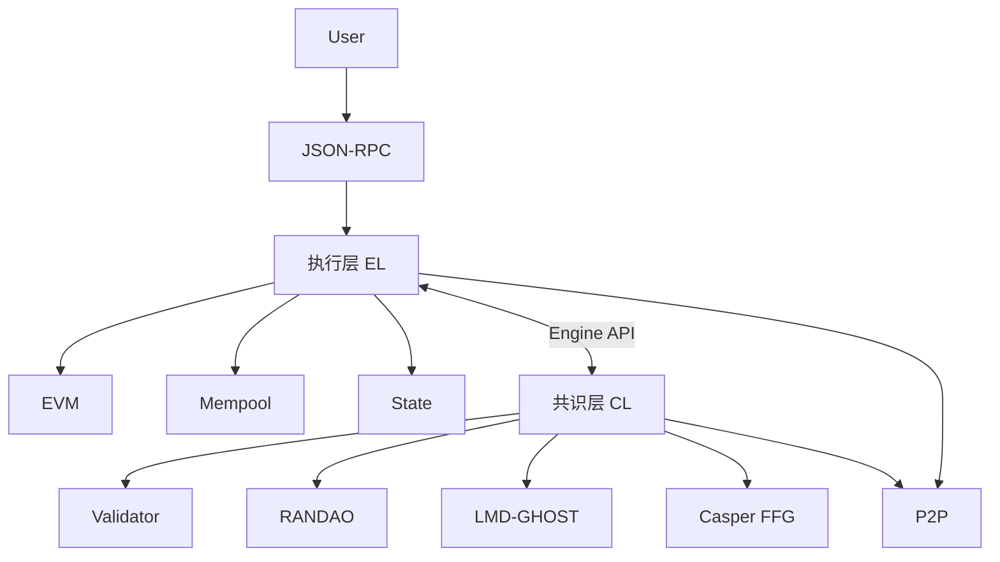

# duladuladula

**GitHub ID:** duladuladula

**Telegram:** 

## Self-introduction

EPF 实习计划

## Notes

<!-- Content_START -->
# 2026-04-10
<!-- DAILY_CHECKIN_2026-04-10_START -->
学习交易字段与生命周期和EVM 执行模型基础,AI总结

* * *

# 一、交易（Transaction）字段结构

以 Ethereum 为例，交易分为几种类型（Legacy / EIP-1559 / EIP-2930），核心字段如下：

## 1\. 通用核心字段（所有交易都有）

| 字段 | 含义 | 工程要点 |
| --- | --- | --- |
| from | 发送者地址 | 由签名恢复（不是直接存储） |
| to | 接收者地址 | 为空 = 合约创建 |
| value | 转账金额 | 单位：wei |
| nonce | 账户交易序号 | 防重放 + 顺序执行 |
| data | 输入数据 | 调用函数或部署代码 |
| gasLimit | 最大 Gas | 防止无限执行 |
| v,r,s | 签名 | 椭圆曲线签名 |

* * *

## 2\. EIP-1559（当前主流）

| 字段 | 含义 |
| --- | --- |
| maxFeePerGas | 用户愿意支付的最高 gas 价格 |
| maxPriorityFeePerGas | 给矿工/验证者的小费 |

👉 实际费用：

```
gasPrice = min(maxFeePerGas, baseFee + priorityFee)
```

* * *

## 3\. 合约调用 data 结构

```
data = function_selector(4 bytes) + 参数编码
```

示例：

```
0xa9059cbb + 地址 + 数量
```

* * *

# 二、交易生命周期（Transaction Lifecycle）

从用户发起到最终确认：

## 1\. 构造与签名

-   钱包（如 MetaMask）构造交易
    
-   使用私钥签名
    
-   得到 raw transaction
    

* * *

## 2\. 广播（P2P 网络）

-   通过 Peer-to-peer network 广播
    
-   节点进行基本校验：
    
    -   签名正确
        
    -   nonce 合法
        
    -   余额足够支付 gas
        

进入 **mempool（交易池）**

* * *

## 3\. 打包（Block Inclusion）

-   验证者选择交易（按 gas 费排序）
    
-   构建区块
    

在 Proof of Stake 中：

-   proposer 负责打包
    
-   builder（MEV）可能参与
    

* * *

## 4\. 执行（Execution）

由 Ethereum Virtual Machine 执行：

-   状态读取（账户 / storage）
    
-   执行 opcode
    
-   更新状态树（Merkle Patricia Trie）
    

* * *

## 5\. 共识确认（Finality）

-   区块被链接受
    
-   在 Ethereum 2.0 中：
    
    -   Slot → Epoch → Finalized
        

* * *

## 生命周期总结（工程视角）

```
构造 → 签名 → 广播 → mempool → 打包 → EVM执行 → 状态变更 → Finality
```

* * *

# 三、EVM 执行模型（核心）

## 1\. 基本架构

Ethereum Virtual Machine 是：

-   **基于栈（Stack-based）虚拟机**
    
-   256-bit word
    
-   确定性执行（deterministic）
    

* * *

## 2\. 四大数据区

| 区域 | 特点 | 生命周期 |
| --- | --- | --- |
| Stack | 最多 1024 层 | 临时 |
| Memory | 线性内存 | 调用期间 |
| Storage | 持久存储 | 链上 |
| Calldata | 只读输入 | 调用期间 |

* * *

## 3\. 执行流程

一次交易执行大致为：

```
1. 扣除 upfront gas
2. 加载 calldata
3. 执行 opcode（逐条）
4. 状态修改（storage）
5. gas 消耗
6. 成功 or revert
7. 退还剩余 gas
```

* * *

## 4\. Opcode 执行机制

典型 opcode：

| 类别 | 示例 |
| --- | --- |
| 算术 | ADD, MUL |
| 存储 | SLOAD, SSTORE |
| 控制流 | JUMP |
| 外部调用 | CALL |
| 合约创建 | CREATE |

👉 特点：

-   每条 opcode 有 gas 成本
    
-   防止 DoS 攻击
    

* * *

## 5\. Gas 机制（关键）

核心设计目标：

-   防止无限循环
    
-   衡量计算资源
    
-   激励验证者
    

执行规则：

```
gas_used += opcode_cost
```

特殊点：

-   `SSTORE` 很贵
    
-   `CALL` 会带 gas 传递
    
-   `REVERT` 不消耗全部 gas
    

* * *

## 6\. 调用模型（Message Call）

合约之间调用：

```
CALL / DELEGATECALL / STATICCALL
```

关键区别：

| 类型 | storage | msg.sender |
| --- | --- | --- |
| CALL | 被调用合约 | 调用者 |
| DELEGATECALL | 调用者 | 原始调用者 |

* * *

## 7\. 状态模型

EVM 操作的是 **账户模型（Account Model）**

账户包含：

-   nonce
    
-   balance
    
-   storageRoot
    
-   codeHash
    

* * *

# 四、执行结果（Transaction Receipt）

执行后生成：

| 字段 | 说明 |
| --- | --- |
| status | 成功 / 失败 |
| gasUsed | 消耗 gas |
| logs | 事件日志 |
| contractAddress | 新合约地址 |

* * *

# 五、关键设计总结（面试高频）

## 1\. 为什么要 nonce？

-   防重放攻击
    
-   保证交易顺序
    

* * *

## 2\. 为什么要 gas？

-   限制计算资源
    
-   防止 DoS
    
-   市场化定价执行资源
    

* * *

## 3\. EVM 为什么是栈机？

优点：

-   简单
    
-   易验证
    
-   易实现跨平台一致性
    

缺点：

-   不利于优化（相比寄存器 VM）
    

* * *

## 4\. 执行 vs 共识分离（EL / CL）

现代以太坊架构：

| 层 | 作用 |
| --- | --- |
| EL（执行层） | 处理交易 + EVM |
| CL（共识层） | 决定区块顺序 |

* * *

# 六、一句话总结

> Web3 交易本质是：  
> **签名驱动的状态转换请求 → 经 P2P 广播 → 被区块打包 → 在 EVM 中按 gas 约束执行 → 最终改变全局状态。**

* * *
<!-- DAILY_CHECKIN_2026-04-10_END -->

# 2026-04-09
<!-- DAILY_CHECKIN_2026-04-09_START -->

执行层核心规范和EL 客户端模块总览总结

* * *

# 一、执行层核心规范（Protocol View）

执行层可以形式化为一个状态机系统：

```
State + Transactions → New State
```

其规范核心可以拆为 6 大子系统：

* * *

## 1\. 状态系统（State System）

**规范要点：**

-   全局状态：`σ = {address → account}`
    
-   数据结构：**Merkle Patricia Trie（MPT）**
    
-   状态承诺：`stateRoot`
    

**约束：**

-   状态必须可验证（Merkle Proof）
    
-   状态更新必须 deterministic
    

* * *

## 2\. 状态转换函数（STF）

核心定义：

```
σ' = Υ(σ, T)
```

执行流程（强规范）：

1.  nonce 校验
    
2.  预扣 Gas
    
3.  EVM 执行
    
4.  状态写入
    
5.  Gas 结算
    
6.  receipt 生成
    

**关键点：**

-   任意客户端必须逐字节一致执行
    
-   任意偏差 → 分叉（consensus failure）
    

* * *

## 3\. 交易规范（Transaction Spec）

**多类型交易（EIP-2718）**

-   Legacy
    
-   EIP-1559（动态费用）
    
-   EIP-2930（Access List）
    
-   EIP-4844（Blob Tx）
    

**核心字段约束：**

-   `nonce`：严格递增
    
-   `gasLimit`：上限约束
    
-   `maxFeePerGas` ≥ `baseFee`
    

* * *

## 4\. Gas 与费用市场

**本质：资源计量系统**

### 核心机制：

-   opcode 定价（静态 + 动态）
    
-   Gas 消耗不可逆
    
-   Out-of-Gas → revert
    

### EIP-1559：

-   `baseFee`（协议销毁）
    
-   `priorityFee`（激励验证者）
    

* * *

## 5\. EVM 执行规范

**执行模型：**

-   Stack-based VM
    
-   256-bit word
    
-   单线程、确定性
    

**执行上下文：**

-   `msg.sender`
    
-   `msg.value`
    
-   `msg.data`
    
-   `gas`
    

**关键约束：**

-   最大调用深度：1024
    
-   storage 写入高成本（SSTORE）
    

* * *

## 6\. 区块执行规范（Block Execution）

执行层验证：

-   所有交易顺序执行
    
-   最终：
    
    -   `stateRoot`
        
    -   `receiptsRoot`
        
    -   `gasUsed`
        

必须匹配区块 header

* * *

## 7\. EL ↔ CL 接口（Engine API）

执行层不是孤立的：

-   共识层决定“哪个区块”
    
-   执行层决定“区块是否合法”
    

核心接口：

-   `engine_newPayload`
    
-   `engine_forkchoiceUpdated`
    
-   `engine_getPayload`
    

* * *

# 二、EL 客户端模块总览（Implementation View）

把上面规范映射到客户端（如 Geth / Nethermind），可以拆成如下模块：

* * *

## 1\. 网络层（P2P Networking）

**职责：**

-   交易传播（Tx Gossip）
    
-   区块传播
    
-   状态同步
    

**协议：**

-   devp2p
    
-   eth/66+
    

* * *

## 2\. 交易池（TxPool）

**核心作用：**

-   缓存未打包交易（mempool）
    

**子逻辑：**

-   nonce 排序
    
-   Gas 价格排序
    
-   替换规则（Replace-by-fee）
    

**约束：**

-   必须保证可执行性（连续 nonce）
    

* * *

## 3\. 区块处理器（Block Processor）

对应协议里的 **区块执行规范**

**职责：**

-   按顺序执行交易
    
-   调用 EVM
    
-   生成新状态
    

**关键校验：**

-   gasUsed
    
-   stateRoot
    
-   receiptsRoot
    

* * *

## 4\. EVM 执行引擎

对应协议里的 **EVM 规范**

模块拆分：

-   Interpreter（解释器）
    
-   Opcode 实现
    
-   Gas 计费器
    
-   Call Stack 管理
    

* * *

## 5\. 状态数据库（State DB）

对应协议里的 **状态系统**

**实现细节：**

-   MPT Trie
    
-   LevelDB / RocksDB 存储
    
-   snapshot / cache
    

**功能：**

-   账户读取/写入
    
-   storage 管理
    
-   状态回滚（journal）
    

* * *

## 6\. 区块链管理器（Blockchain）

**职责：**

-   维护 canonical chain
    
-   处理分叉（fork choice 由 CL 提供）
    
-   区块持久化
    

* * *

## 7\. 共识接口层（Engine API Client）

对应协议：

-   EL ↔ CL 通信
    

**职责：**

-   接收 CL payload
    
-   返回执行结果
    
-   提供区块构建能力
    

* * *

## 8\. 同步模块（Sync）

**模式：**

-   Full Sync
    
-   Snap Sync
    
-   Beam Sync（历史）
    

**目标：**

-   快速重建 state
    

* * *

## 9\. 日志与事件系统（Logs / Filters）

对应：

-   receipt / logs
    

**用途：**

-   DApp 查询
    
-   事件订阅
    

* * *

## 10\. RPC 服务层

**接口：**

-   JSON-RPC（eth\_\*）
    

**功能：**

-   查询状态
    
-   发送交易
    
-   调试接口（debug\_trace）
    

* * *

# 三、规范 → 模块映射（核心理解）

| 协议规范 | 客户端模块 |
| --- | --- |
| 状态模型（MPT） | State DB |
| 状态转换函数 | Block Processor |
| EVM 规范 | EVM Engine |
| Gas 机制 | Gas Metering（EVM 内） |
| 交易规范 | TxPool |
| 区块执行 | Blockchain + Processor |
| Engine API | Consensus Interface |

* * *

# 四、整体执行流程（端到端）

一笔交易从进入系统到落链：

```
1. P2P 接收交易
2. TxPool 排序缓存
3. CL 触发打包（proposer）
4. EL 构建区块（执行交易）
5. 生成 Execution Payload
6. 提交给 CL
7. CL 共识确认
8. EL 持久化状态
```

* * *

# 五、关键工程难点（你需要特别理解）

## 1\. 状态膨胀（State Explosion）

-   storage 无限增长
    
-   trie 性能瓶颈
    

## 2\. Gas 定价复杂性

-   SSTORE / cold access / warm access
    
-   多 EIP 叠加（2200, 2929, 3529）
    

## 3\. 执行确定性

-   不允许任何非确定性行为
    
-   不同客户端必须完全一致
    

## 4\. 同步性能

-   state rebuild 成本极高
    
-   snapshot / stateless 研究中
    

* * *

# 六、一句话总结（更工程版）

> **执行层规范定义“必须做什么”，EL 客户端模块实现“如何高效且一致地做到”。**

* * *
<!-- DAILY_CHECKIN_2026-04-09_END -->

# 2026-04-08
<!-- DAILY_CHECKIN_2026-04-08_START -->


以太坊的核心哲学 = 用最小的底层规则（简洁 + 通用），通过模块化和封装控制复杂性，同时保持中立和可演进，让上层应用自由生长.

区块链级协议总结

* * *

# 📘 以太坊核心机制总结（工程视角）

* * *

# 一、账户模型 vs UTXO 模型

## 1\. UTXO（比特币模型）

-   本质：**未花费交易输出集合**
    
-   余额定义：
    
    -   用户拥有的所有 UTXO 总和
        
-   特点：
    
    -   ✅ 更强隐私性
        
    -   ❌ 状态管理复杂
        
    -   ❌ 不利于复杂逻辑（如 DEX）
        

* * *

## 2\. 账户模型（以太坊）

-   核心：直接记录
    
    ```
    address → balance + nonce + storage
    ```
    
-   优势：
    

### ✅ 节省存储空间

-   UTXO：多个碎片
    
-   账户：单一状态
    

### ✅ 完全可互换性（Fungibility）

-   不追踪“币的历史”
    
-   无污染问题
    

### ✅ 更适合智能合约

-   支持复杂状态机
    
-   支持 DeFi / DEX
    

* * *

## 3\. 缺点

### ❌ 需要 nonce

-   防止重放攻击
    
-   强制交易顺序
    

### ❌ 状态无法轻易删除

-   导致状态膨胀（State Bloat）
    

* * *

# 二、核心数据结构

* * *

## 1\. Merkle Patricia Trie（MPT）

Merkle Patricia Trie

### 特点：

-   ✅ 确定性
    
-   ✅ 可验证（Merkle Proof）
    
-   ✅ 状态唯一性（root hash）
    

### 复杂度：

-   查询 / 插入 / 删除：
    
    ```
    O(log n)
    ```
    

### 作用：

-   存储：
    
    -   账户状态
        
    -   合约存储
        
    -   交易树
        

* * *

## 2\. Verkle Tree（下一代）

Verkle Tree

### 改进点：

| 特性 | MPT | Verkle |
| --- | --- | --- |
| 证明大小 | O(log n) | O(logₖ n) |
| 带宽消耗 | 高 | 低 |
| 适合无状态 | ❌ | ✅ |

### 核心优势：

-   更小的证明（Witness）
    
-   支持 Stateless Client
    

👉 目标：解决 **状态膨胀（1~2TB）**

* * *

# 三、序列化机制

* * *

## 1\. RLP（Recursive Length Prefix）

### 特点：

-   简单
    
-   确定性强
    
-   不关心数据类型
    

### 缺点：

-   ❌ 不支持 Merkle 化
    
-   ❌ 不适合轻客户端
    

* * *

## 2\. SSZ（Simple Serialize）

SimpleSerialize

### 特点：

-   支持：
    
    -   固定长度
        
    -   可变长度
        
-   内置：
    
    -   Merkleization
        

### 优势：

-   ✅ 快速哈希
    
-   ✅ 支持无状态客户端
    
-   ✅ 更高性能
    

* * *

# 四、共识机制（PoS）

* * *

## 1\. 最终性（Finality）

-   定义：
    
    -   区块**不可回滚**
        
-   条件：
    
    -   至少 **33% ETH 被销毁才可篡改**
        

* * *

## 2\. Casper FFG

Casper FFG

### 机制：

-   验证者投票（Checkpoint）
    
-   两轮投票：
    
    -   Justified
        
    -   Finalized
        

### 特点：

-   BFT 风格
    
-   有惩罚机制（Slashing）
    

* * *

## 3\. LMD-GHOST（分叉选择）

LMD GHOST

### 核心思想：

-   选择：
    
    > **“被最多验证者支持的子树”**
    

### 简化流程：

```
从 Genesis 开始
↓
每一层选择：
  权重（投票数）最大的子块
↓
直到叶子
```

👉 类似 PoW：

-   PoW：选最长链
    
-   LMD-GHOST：选“最重链”
    

* * *

## 4\. Gasper（最终协议）

Gasper

### 组合：

-   Casper FFG（最终性）
    
-   LMD-GHOST（分叉选择）
    

👉 = 完整 PoS 共识

* * *

# 五、P2P 网络与 DHT

* * *

## 1\. DHT（分布式哈希表）

Distributed Hash Table

### 使用场景：

-   ❌ 不用于找区块
    
-   ✅ 用于找节点
    

* * *

## 2\. Kademlia DHT

Kademlia

### 特点：

-   查找复杂度：
    
    ```
    O(log n)
    ```
    
-   存储：
    
    -   ENR（节点记录）
        

* * *

## 3\. Gossip 网络

### 特点：

-   非结构化网络
    
-   广播区块
    

👉 实现：

-   gossipsub
    

* * *

## 4\. 网络结构对比

| 类型 | 查找成本 | 特点 |
| --- | --- | --- |
| 中心化 | O(1) | 单点风险 |
| DHT | O(log n) | 高效查找 |
| Gossip | O(n) | 高鲁棒 |

* * *

## 5\. 为什么“DHT + Gossip”混合？

### 流程：

```
DHT → 找节点
↓
Gossip → 传播区块
```

### 原因：

| 问题 | 解决 |
| --- | --- |
| 冷启动 | DHT 提供全局视图 |
| 动态网络 | Gossip 更稳定 |
| 高 churn | 非结构化更鲁棒 |

* * *

# 六、关键工程结论

* * *

## 1\. 架构核心

```
账户模型 → 简化状态
MPT → 可验证存储
SSZ → 高效序列化
PoS → 安全共识
DHT + Gossip → 网络传播
```

* * *

## 2\. 三大挑战

### ⚠️ 状态膨胀

-   → Verkle Tree
    

### ⚠️ 无状态化

-   → SSZ + Witness
    

### ⚠️ 网络扩展性

-   → Gossip + DHT
    

* * *

## 3\. 本质总结

> 以太坊 =  
> **状态机（账户模型） + 可验证数据结构（MPT） + PoS共识（Gasper） + P2P网络（DHT+Gossip）**

* * *
<!-- DAILY_CHECKIN_2026-04-08_END -->

# 2026-04-07
<!-- DAILY_CHECKIN_2026-04-07_START -->


参加例会


<!-- DAILY_CHECKIN_2026-04-07_END -->

# 2026-04-06
<!-- DAILY_CHECKIN_2026-04-06_START -->


首先了解了一下以太坊产生的一些相关历史,然后阅读和理解以太坊协议分层和模块关系,其中出现了挺多不了解的专业名词,例如EL,CL,P2P网络,PoS等,使用AI进行了相对应的理解,并生成了对应的文档.

* * *

# 一、最核心的三个概念

* * *

## 1️⃣ EL（Execution Layer，执行层）

👉 **定义：**

执行层是区块链中的“计算引擎”，负责：

-   执行交易
    
-   运行智能合约
    
-   更新全局状态
    

* * *

👉 **工程视角：**

你可以把 EL 理解为：

```text
一个状态机（State Machine）
```

* * *

👉 **状态机含义：**

```text
旧状态 + 交易 → 新状态
```

* * *

👉 **举例：**

```text
Alice: 100 ETH
Bob: 50 ETH

交易：Alice → Bob 10 ETH

执行后：
Alice: 90
Bob: 60
```

* * *

👉 **常见实现：**

-   Geth
    
-   Nethermind
    

* * *

## 2️⃣ CL（Consensus Layer，共识层）

👉 **定义：**

共识层负责：

> 决定“哪一个区块是有效的、被全网认可的”

* * *

👉 **核心问题：**

区块链没有中心服务器：

❓ 谁说了算？

👉 CL 解决这个问题

* * *

👉 **工程视角：**

```text
一个“分布式排序系统”
```

* * *

👉 **职责：**

-   选择区块顺序
    
-   防止双花
    
-   统一全网状态
    

* * *

👉 **常见实现：**

-   Prysm
    
-   Lighthouse
    

* * *

## 3️⃣ P2P（Peer-to-Peer，点对点网络）

👉 **定义：**

一种网络模型：

> 节点之间直接通信，没有中心服务器

* * *

👉 **对比：**

| 模型 | 说明 |
| --- | --- |
| 客户端-服务器 | 依赖中心（微信） |
| P2P | 节点互联（区块链） |

* * *

👉 **在区块链中作用：**

-   传播交易
    
-   传播区块
    
-   传播投票
    

* * *

👉 **特点：**

-   去中心化
    
-   抗审查
    
-   容错性强
    

* * *

# 二、执行层相关术语

* * *

## 4️⃣ EVM（Ethereum Virtual Machine）

👉 **定义：**

区块链中的虚拟机（类似 JVM）

* * *

👉 **作用：**

-   执行智能合约
    
-   运行字节码（bytecode）
    

* * *

👉 **类比：**

| 系统 | 虚拟机 |
| --- | --- |
| Java | JVM |
| 以太坊 | EVM |

* * *

👉 **特点：**

-   确定性执行（所有节点结果一致）
    
-   gas 限制防止死循环
    

* * *

* * *

## 5️⃣ Mempool（交易池）

👉 **定义：**

存放“还没被打包进区块”的交易

* * *

👉 **作用：**

-   等待被矿工/验证者选择
    
-   排序（按 gas）
    

* * *

👉 **重要理解：**

```text
Mempool ≠ 区块链
```

它只是“候选区”

* * *

* * *

## 6️⃣ State（状态）

👉 **定义：**

区块链当前的“世界状态”

* * *

👉 **包含：**

-   账户余额
    
-   合约数据
    
-   存储变量
    

* * *

👉 **数据结构：**

-   Merkle Patricia Trie（MPT）
    

* * *

👉 **为什么复杂？**

因为要保证：

-   可验证（hash）
    
-   可回溯
    
-   不可篡改
    

* * *

* * *

## 7️⃣ JSON-RPC

👉 **定义：**

用户与执行层交互的接口协议

* * *

👉 **常见方法：**

-   `eth_sendRawTransaction`
    
-   `eth_call`
    
-   `eth_getBalance`
    

* * *

👉 **作用：**

-   钱包调用
    
-   Web3 应用调用
    

* * *

# 三、共识层相关术语

* * *

## 8️⃣ PoS（Proof of Stake，权益证明）

👉 **定义：**

一种共识机制：

> 谁质押的资产多，谁更有权参与记账

* * *

👉 **核心流程：**

1.  质押 ETH
    
2.  成为验证者
    
3.  被随机选中出块
    
4.  其他人验证
    

* * *

👉 **安全机制：**

-   作恶会被罚（Slashing）
    

* * *

* * *

## 9️⃣ Validator（验证者）

👉 **定义：**

参与共识的节点

* * *

👉 **职责：**

-   提议区块
    
-   投票（Attestation）
    

* * *

👉 **获得收益：**

-   出块奖励
    
-   手续费
    

* * *

* * *

## 🔟 RANDAO（随机数机制）

👉 **定义：**

一种生成随机数的方法

* * *

👉 **用途：**

-   随机选择出块者
    

* * *

👉 **为什么需要？**

防止：

-   人为控制出块顺序
    
-   攻击网络
    

* * *

* * *

## 1️⃣1️⃣ LMD-GHOST（Fork Choice）

👉 **定义：**

一种“选链规则”

* * *

👉 **作用：**

当出现分叉时：

👉 决定选哪条链

* * *

👉 **核心思想：**

> 选择“被最多人支持”的链

* * *

* * *

## 1️⃣2️⃣ Casper FFG（Finality）

👉 **定义：**

最终确认机制

* * *

👉 **作用：**

确保区块：

-   不可回滚
    
-   不可篡改
    

* * *

👉 **阶段：**

1.  Justified
    
2.  Finalized
    

* * *

* * *

## 1️⃣3️⃣ Attestation（投票）

👉 **定义：**

验证者对区块的“表态”

* * *

👉 **类似：**

```text
“我认为这个区块是正确的”
```

* * *

* * *

## 1️⃣4️⃣ Beacon Chain

👉 **定义：**

共识层主链

* * *

👉 **作用：**

-   管理验证者
    
-   管理共识
    
-   协调全网
    

* * *

# 四、跨层关键术语

* * *

## 1️⃣5️⃣ Engine API

👉 **定义：**

执行层（EL）和共识层（CL）之间的接口

* * *

👉 **核心调用：**

-   `getPayload`
    
-   `newPayload`
    
-   `forkchoiceUpdated`
    

* * *

👉 **作用：**

```text
CL 发命令 → EL 执行 → 返回结果
```

* * *

* * *

## 1️⃣6️⃣ Beacon API

👉 **定义：**

共识层与验证者之间的接口

* * *

👉 **作用：**

-   获取区块
    
-   提交投票
    

* * *

* * *

## 1️⃣7️⃣ Gas

👉 **定义：**

执行计算的“费用单位”

* * *

👉 **作用：**

-   防止滥用计算资源
    
-   衡量计算成本
    

* * *

👉 **类比：**

```text
EVM = CPU
Gas = 电费
```

* * *

# 五、一张总览关系图（帮你串起来）



* * *

# 六、终极总结（一定要记住）

* * *

## 一句话版：

```text
EL 负责计算结果  
CL 负责决定哪个结果有效  
P2P 负责把结果传给所有人
```

* * *

## 工程版：

```text
区块链 = 状态机（EL） + 共识协议（CL） + 网络层（P2P）
```

* * *

# 七、完整交易生命周期（工程级）

```
sequenceDiagram
    autonumber

    participant User as 用户
    participant RPC as JSON-RPC
    participant Mempool as Tx Pool
    participant EL as 执行层
    participant CL as 共识层
    participant P2P as 网络
    participant Proposer as 出块者
    participant Validators as 验证者

    User->>RPC: 发送交易
    RPC->>Mempool: 校验并入池

    Mempool->>P2P: 广播交易

    CL->>Proposer: 选择出块者

    Proposer->>EL: 请求构建区块
    EL->>Mempool: 选择交易
    EL->>EL: 执行交易
    EL-->>Proposer: 返回区块

    Proposer->>P2P: 广播区块

    CL->>EL: 验证区块
    EL-->>CL: 返回执行结果

    Validators->>CL: 投票

    CL->>CL: Fork Choice

    Validators->>CL: Finality 投票
    CL->>CL: Finalized
```
<!-- DAILY_CHECKIN_2026-04-06_END -->
<!-- Content_END -->
