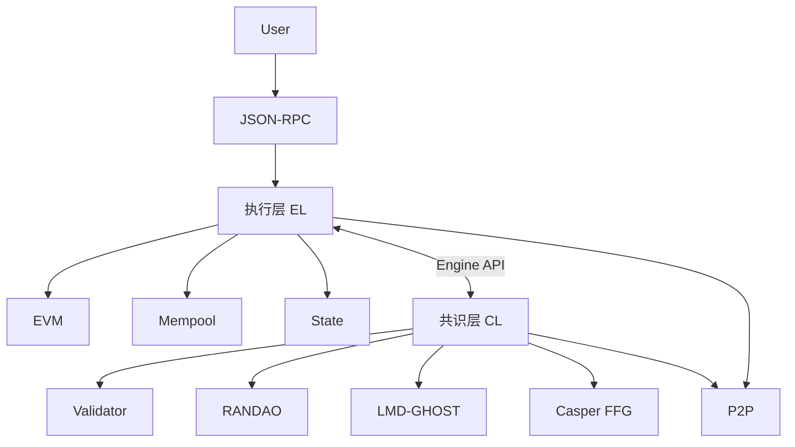

# duladuladula

**GitHub ID:** duladuladula

**Telegram:** 

## Self-introduction

EPF 实习计划

## Notes

<!-- Content_START -->
# 2026-04-06
<!-- DAILY_CHECKIN_2026-04-06_START -->
首先了解了一下以太坊产生的一些相关历史,然后阅读和理解以太坊协议分层和模块关系,其中出现了挺多不了解的专业名词,例如EL,CL,P2P网络,PoS等,使用AI进行了相对应的理解,并生成了对应的文档.

* * *

# 一、最核心的三个概念

* * *

## 1️⃣ EL（Execution Layer，执行层）

👉 **定义：**

执行层是区块链中的“计算引擎”，负责：

-   执行交易
    
-   运行智能合约
    
-   更新全局状态
    

* * *

👉 **工程视角：**

你可以把 EL 理解为：

```text
一个状态机（State Machine）
```

* * *

👉 **状态机含义：**

```text
旧状态 + 交易 → 新状态
```

* * *

👉 **举例：**

```text
Alice: 100 ETH
Bob: 50 ETH

交易：Alice → Bob 10 ETH

执行后：
Alice: 90
Bob: 60
```

* * *

👉 **常见实现：**

-   Geth
    
-   Nethermind
    

* * *

## 2️⃣ CL（Consensus Layer，共识层）

👉 **定义：**

共识层负责：

> 决定“哪一个区块是有效的、被全网认可的”

* * *

👉 **核心问题：**

区块链没有中心服务器：

❓ 谁说了算？

👉 CL 解决这个问题

* * *

👉 **工程视角：**

```text
一个“分布式排序系统”
```

* * *

👉 **职责：**

-   选择区块顺序
    
-   防止双花
    
-   统一全网状态
    

* * *

👉 **常见实现：**

-   Prysm
    
-   Lighthouse
    

* * *

## 3️⃣ P2P（Peer-to-Peer，点对点网络）

👉 **定义：**

一种网络模型：

> 节点之间直接通信，没有中心服务器

* * *

👉 **对比：**

| 模型 | 说明 |
| --- | --- |
| 客户端-服务器 | 依赖中心（微信） |
| P2P | 节点互联（区块链） |

* * *

👉 **在区块链中作用：**

-   传播交易
    
-   传播区块
    
-   传播投票
    

* * *

👉 **特点：**

-   去中心化
    
-   抗审查
    
-   容错性强
    

* * *

# 二、执行层相关术语

* * *

## 4️⃣ EVM（Ethereum Virtual Machine）

👉 **定义：**

区块链中的虚拟机（类似 JVM）

* * *

👉 **作用：**

-   执行智能合约
    
-   运行字节码（bytecode）
    

* * *

👉 **类比：**

| 系统 | 虚拟机 |
| --- | --- |
| Java | JVM |
| 以太坊 | EVM |

* * *

👉 **特点：**

-   确定性执行（所有节点结果一致）
    
-   gas 限制防止死循环
    

* * *

* * *

## 5️⃣ Mempool（交易池）

👉 **定义：**

存放“还没被打包进区块”的交易

* * *

👉 **作用：**

-   等待被矿工/验证者选择
    
-   排序（按 gas）
    

* * *

👉 **重要理解：**

```text
Mempool ≠ 区块链
```

它只是“候选区”

* * *

* * *

## 6️⃣ State（状态）

👉 **定义：**

区块链当前的“世界状态”

* * *

👉 **包含：**

-   账户余额
    
-   合约数据
    
-   存储变量
    

* * *

👉 **数据结构：**

-   Merkle Patricia Trie（MPT）
    

* * *

👉 **为什么复杂？**

因为要保证：

-   可验证（hash）
    
-   可回溯
    
-   不可篡改
    

* * *

* * *

## 7️⃣ JSON-RPC

👉 **定义：**

用户与执行层交互的接口协议

* * *

👉 **常见方法：**

-   `eth_sendRawTransaction`
    
-   `eth_call`
    
-   `eth_getBalance`
    

* * *

👉 **作用：**

-   钱包调用
    
-   Web3 应用调用
    

* * *

# 三、共识层相关术语

* * *

## 8️⃣ PoS（Proof of Stake，权益证明）

👉 **定义：**

一种共识机制：

> 谁质押的资产多，谁更有权参与记账

* * *

👉 **核心流程：**

1.  质押 ETH
    
2.  成为验证者
    
3.  被随机选中出块
    
4.  其他人验证
    

* * *

👉 **安全机制：**

-   作恶会被罚（Slashing）
    

* * *

* * *

## 9️⃣ Validator（验证者）

👉 **定义：**

参与共识的节点

* * *

👉 **职责：**

-   提议区块
    
-   投票（Attestation）
    

* * *

👉 **获得收益：**

-   出块奖励
    
-   手续费
    

* * *

* * *

## 🔟 RANDAO（随机数机制）

👉 **定义：**

一种生成随机数的方法

* * *

👉 **用途：**

-   随机选择出块者
    

* * *

👉 **为什么需要？**

防止：

-   人为控制出块顺序
    
-   攻击网络
    

* * *

* * *

## 1️⃣1️⃣ LMD-GHOST（Fork Choice）

👉 **定义：**

一种“选链规则”

* * *

👉 **作用：**

当出现分叉时：

👉 决定选哪条链

* * *

👉 **核心思想：**

> 选择“被最多人支持”的链

* * *

* * *

## 1️⃣2️⃣ Casper FFG（Finality）

👉 **定义：**

最终确认机制

* * *

👉 **作用：**

确保区块：

-   不可回滚
    
-   不可篡改
    

* * *

👉 **阶段：**

1.  Justified
    
2.  Finalized
    

* * *

* * *

## 1️⃣3️⃣ Attestation（投票）

👉 **定义：**

验证者对区块的“表态”

* * *

👉 **类似：**

```text
“我认为这个区块是正确的”
```

* * *

* * *

## 1️⃣4️⃣ Beacon Chain

👉 **定义：**

共识层主链

* * *

👉 **作用：**

-   管理验证者
    
-   管理共识
    
-   协调全网
    

* * *

# 四、跨层关键术语

* * *

## 1️⃣5️⃣ Engine API

👉 **定义：**

执行层（EL）和共识层（CL）之间的接口

* * *

👉 **核心调用：**

-   `getPayload`
    
-   `newPayload`
    
-   `forkchoiceUpdated`
    

* * *

👉 **作用：**

```text
CL 发命令 → EL 执行 → 返回结果
```

* * *

* * *

## 1️⃣6️⃣ Beacon API

👉 **定义：**

共识层与验证者之间的接口

* * *

👉 **作用：**

-   获取区块
    
-   提交投票
    

* * *

* * *

## 1️⃣7️⃣ Gas

👉 **定义：**

执行计算的“费用单位”

* * *

👉 **作用：**

-   防止滥用计算资源
    
-   衡量计算成本
    

* * *

👉 **类比：**

```text
EVM = CPU
Gas = 电费
```

* * *

# 五、一张总览关系图（帮你串起来）



* * *

# 六、终极总结（一定要记住）

* * *

## 一句话版：

```text
EL 负责计算结果  
CL 负责决定哪个结果有效  
P2P 负责把结果传给所有人
```

* * *

## 工程版：

```text
区块链 = 状态机（EL） + 共识协议（CL） + 网络层（P2P）
```

* * *

# 七、完整交易生命周期（工程级）

```
sequenceDiagram
    autonumber

    participant User as 用户
    participant RPC as JSON-RPC
    participant Mempool as Tx Pool
    participant EL as 执行层
    participant CL as 共识层
    participant P2P as 网络
    participant Proposer as 出块者
    participant Validators as 验证者

    User->>RPC: 发送交易
    RPC->>Mempool: 校验并入池

    Mempool->>P2P: 广播交易

    CL->>Proposer: 选择出块者

    Proposer->>EL: 请求构建区块
    EL->>Mempool: 选择交易
    EL->>EL: 执行交易
    EL-->>Proposer: 返回区块

    Proposer->>P2P: 广播区块

    CL->>EL: 验证区块
    EL-->>CL: 返回执行结果

    Validators->>CL: 投票

    CL->>CL: Fork Choice

    Validators->>CL: Finality 投票
    CL->>CL: Finalized
```
<!-- DAILY_CHECKIN_2026-04-06_END -->
<!-- Content_END -->
