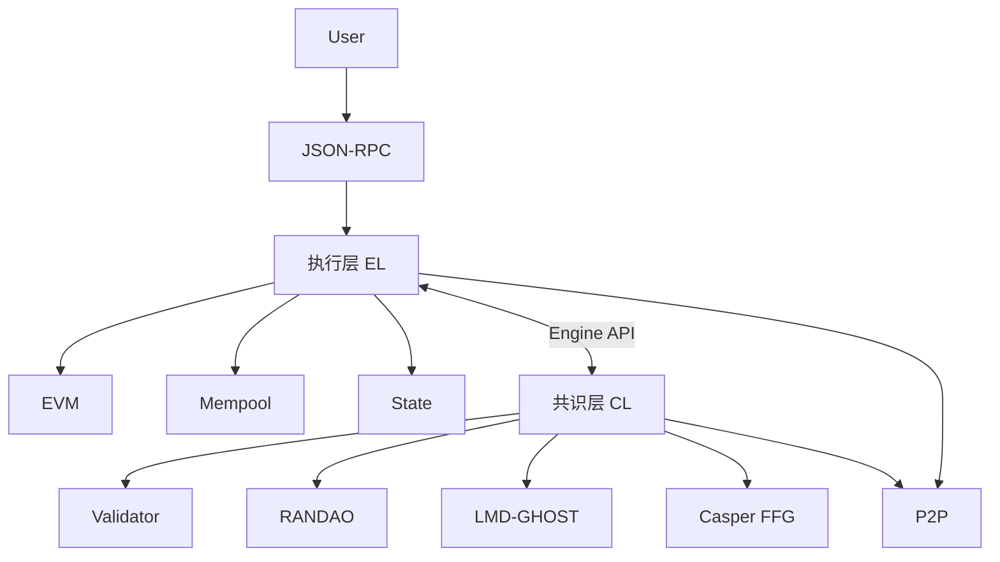

# duladuladula

**GitHub ID:** duladuladula

**Telegram:** 

## Self-introduction

EPF 实习计划

## Notes

<!-- Content_START -->
# 2026-04-22
<!-- DAILY_CHECKIN_2026-04-22_START -->
研究方向全景图和扩容路线与关键方案和提议者与构建者分离学习,AI总结

* * *

## 1\. Web3 研究全景图 (The Panorama)

当前的研究不再局限于单一链，而是围绕“以太坊为中心的结算层”+“多链互联”展开：

-   **密码学前沿：** **ZK (Zero-Knowledge)** 技术的全面应用，包括 ZK-EVM 的性能优化、递归证明以及抗量子攻击密码学（Post-Quantum Cryptography）。
    
-   **状态管理：** 致力于解决“状态爆炸”问题，研究方向包括 **Verkle Trees**（允许节点在无状态下验证区块）和 **EIP-4444**（历史数据清理）。
    
-   **MEV (最大可提取价值) 经济学：** 研究如何民主化 MEV 收益，防止验证者中心化，重点在于 **Burn MEV** 或 **MEV Smoothing**。
    
-   **用户主权：** 智能合约钱包（AA/EIP-4337）与隐私保护技术（如全同态加密 FHE 在链上的初步探索）。
    

* * *

## 2\. 扩容路线图：Rollup-Centric Roadmap

以太坊的扩容已定性为“以 Rollup 为中心”，2026 年的重点在于从“数据可用性”转向“验证效率”。

| 阶段 | 核心技术方案 | 目标 | 现状 (2026) |
| 数据层 (The Surge) | Danksharding & Blobs | 增加 Layer 2 存入 L1 的数据容量。 | 已实现多 Blob 并行，大幅降低 L2 手续费。 |
| 执行层优化 | Parallel EVM | 利用并行处理技术提升单链 TPS。 | 主流 L2 和部分新 L1（如 Monad 等方案）已广泛采用。 |
| 验证层 (ZK-fication) | ZK-Settlement | L1 验证 L2 证明的时间从几天缩短至分钟级。 | L1 开始原生支持 ZK 验证，减少对乐观证明的依赖。 |

* * *

## 3\. 提议者与构建者分离 (PBS)

这是为了应对 **MEV 导致的中心化风险**而提出的核心架构变革。

### 为什么需要 PBS？

在原始设计中，验证者（Proposer）既负责“选交易”也负责“打包”。这导致拥有强大计算资源的专业机构能通过精密算法提取更多 MEV，从而让小额质押者（家庭节点）在收益上处于劣势，最终导致网络中心化。

### 关键角色与流程

PBS 将“权力”一分为二：

1.  **构建者 (Builders)：** 专业机构，负责在内存池（Mempool）中筛选交易、排序并构建最赚钱的区块。
    
2.  **提议者 (Proposers)：** 即普通验证者。他们只需在多个构建者提供的区块头中，“盲选”出出价最高的一个进行签名。
    

### 演进阶段

-   **MEV-Boost (外挂阶段)：** 目前主流方案。验证者运行第三方软件（如 Flashbots）来接入构建者市场。
    
-   **ePBS (原生 PBS/EIP-7732)：** 2026 年的重点。将分离逻辑直接写入以太坊协议层。
    
    > **优点：** 消除对第三方中继器（Relays）的信任依赖，增强网络的抗审查性（如通过 **Inclusion Lists** 强制构建者包含某些交易）。
    

* * *

## 4\. 核心提议总结 (Key Proposals)

-   **EIP-4844 (Proto-Danksharding)：** 奠定了数据分片的基础。
    
-   **EIP-7732 (Enshrined PBS)：** 正在推进的协议层 PBS，旨在让每个节点都能平等获得 MEV 收益。
    
-   **EIP-7928 (Block-Level Access Lists)：** 为并行执行做准备，提升区块处理速度。
    

* * *

**总结：** 2026 年的 Web3 技术栈正变得极其精精密。**扩容**通过“数据分片+ZK证明”实现，而**公平性**通过“ePBS”来保障。这种架构确保了即便在每秒处理上万笔交易的情况下，普通的笔记本电脑依然可以参与网络验证。
<!-- DAILY_CHECKIN_2026-04-22_END -->

# 2026-04-21
<!-- DAILY_CHECKIN_2026-04-21_START -->

参加会议学习


<!-- DAILY_CHECKIN_2026-04-21_END -->

# 2026-04-20
<!-- DAILY_CHECKIN_2026-04-20_START -->


今天复习以太坊执行层核心机制、EVM 对象格式升级EOF、CL 客户端内部设计,共识层网络通信
<!-- DAILY_CHECKIN_2026-04-20_END -->

# 2026-04-19
<!-- DAILY_CHECKIN_2026-04-19_START -->


CL 客户端内部设计和主流 CL 客户端对比学习,AI总结

* * *

## 1\. CL 客户端内部核心设计架构

一个典型的 CL 客户端通常包含以下几个核心模块，这些模块共同协作以维持网络共识。

### 核心模块 (Core Components)

-   **信标状态机 (Beacon State Machine):** 客户端的核心。它负责根据分叉选择规则（LMD-GHOST）和 Casper FFG 更新区块链状态，处理验证者的质押、处罚及奖励逻辑。
    
-   **P2P 网络层 (Gossip & Libp2p):** 基于 `libp2p` 协议栈，负责与其他节点通信。CL 客户端有多个专门的 **GossipSub 子网**，分别处理区块广播、证明（Attestations）聚合和同步委员会投票。
    
-   **数据库 (Database/Storage):** 存储信标状态（Beacon State）和历史区块。由于信标状态体积巨大，现代客户端多采用\*\*状态序列化（SSZ）\*\*和增量存储技术来优化。
    
-   **验证者客户端接口 (Validator Client Interface):** 虽然验证者软件常与信标节点分离，但 CL 客户端必须提供高性能接口（如 REST API），供验证者进行签名和提交任务。
    
-   **Engine API 适配器:** 负责与 EL 客户端（如 Geth）通信，获取执行负载（Execution Payload）并告知 EL 哪个区块已被确认。
    

* * *

## 2\. 主流 CL 客户端对比 (2026年现状)

以太坊目前拥有高度多元化的客户端生态。这种多样性是网络防御“单点故障”的核心。

### 1\. **Prysm (Go 语言)**

-   **地位：** 目前市场份额最高、生态最成熟的客户端。
    
-   **特点：** \* **上手难度低：** 文档极其丰富，社区支持最强。
    
    -   **企业级设计：** 内部采用模块化设计，对大型质押节点友好。
        
-   **缺点：** 长期处于绝对领先地位带来的“客户端多样性风险”。
    

### 2\. **Lighthouse (Rust 语言)**

-   **地位：** 性能与安全性的标杆。
    
-   **特点：**
    
    -   **性能极致：** 得益于 Rust 的无垃圾回收（GC）机制，在高负载下表现异常稳定，CPU 和内存占用极低。
        
    -   **安全性高：** 内存安全特性显著减少了崩溃和漏洞。
        
-   **适合：** 追求高性能和极致稳定性的专业运维人员。
    

### 3\. **Teku (Java 语言)**

-   **地位：** 专为企业和大型机构设计。
    
-   **特点：**
    
    -   **企业兼容性：** 由 ConsenSys 开发，支持外部密钥管理系统（如 Web3Signer）。
        
    -   **灵活性：** 对各种数据库引擎和操作系统支持良好。
        
-   **适合：** 金融机构、云服务提供商。
    

### 4\. **Nimbus (Nim 语言)**

-   **地位：** 轻量化领跑者。
    
-   **特点：**
    
    -   **极致轻量：** 专门针对资源受限设备（如树莓派、移动端）优化。
        
    -   **低功耗：** 是目前所有客户端中对硬件要求最低的。
        
-   **适合：** 家庭个人节点、嵌入式系统。
    

* * *

## 3\. 关键性能指标对比表

| 客户端 | 开发语言 | 核心优势 | 适用人群 | 资源占用 |
| Prysm | Go | 文档完善、生态广 | 初学者、大众验证者 | 中等 |
| Lighthouse | Rust | 响应极快、内存安全 | 追求性能的专业玩家 | 较低 |
| Teku | Java | 机构级安全、多后端支持 | 企业、大型矿池 | 较高 |
| Nimbus | Nim | 极低资源消耗 | 树莓派、弱网环境 | 极低 |

* * *

## 4\. 2026 年的新趋势：模块化与轻量化

随着以太坊路线图的推进，CL 客户端正朝着以下方向演进：

-   **无状态性 (Statelessness):** 引入 Verkle 树后，客户端不再需要存储庞大的历史状态即可验证区块。
    
-   **原生支持轻客户端:** 如 **ethlambda** 等新兴实验性客户端，旨在让浏览器直接运行共识逻辑。
    
-   **P2P 层优化:** 通过减少冗余的 Gossip 消息，进一步降低质押者的带宽成本。
    

> **提示：** 运行节点时，建议避开当前市场份额占比超过 33% 的客户端，以保护网络在遭遇软件 Bug 时不会发生大规模削减（Slashing）事故。
<!-- DAILY_CHECKIN_2026-04-19_END -->

# 2026-04-18
<!-- DAILY_CHECKIN_2026-04-18_START -->


共识层网络通信和弱主观性与同步机制学习,AI总结

* * *

## 1\. 共识层网络通信 (Networking)

共识层的通信主要基于 **p2p (Peer-to-Peer)** 协议，通常使用 `libp2p` 栈。其核心目标是确保数万个验证者节点能快速交换投票（Attestations）和区块。

-   **GossipSub 协议：** 消息不是发给所有人，而是通过“传播树”向邻居节点扩散。为了节省带宽，验证者被分配到不同的\*\*子网（Subnets）\*\*中，只接收和转发与自己分配的任务相关的投票。
    
-   **消息传播控制：**
    
    -   **聚合（Aggregation）：** 为了避免数万个签名直接冲击主网，验证者会在子网中先进行签名聚合，最终只有聚合后的 BLS 签名才会广播到全局网络。
        
    -   **验证（Validation）：** 节点在转发消息前必须通过基本验证（如签名合法性、是否在正确时隙内），以防止垃圾信息攻击。
        

* * *

## 2\. 弱主观性 (Weak Subjectivity)

这是 PoS（权益证明）与 PoW（工作量证明）最大的哲学与技术区别之一。

-   **定义：** 在 PoW 中，新节点只需遵循“最重链原则”即可客观识别主链。但在 PoS 中，如果一个节点离线时间过长（超过了**弱主观性周期**），它可能无法仅凭协议规则分辨哪条链是真实的，因为攻击者可以伪造一条早已退出的历史验证者签名的长链。
    
-   **检查点（Checkpoints）：** 为了解决这个问题，新加入或长期离线的节点必须从一个**可信源**（如浏览器、社区节点、其他信任实体）获取一个最近的状态快照。
    
-   **信任权衡：** 这种机制引入了极小程度的“主观性”，但通过社交共识（Social Consensus）极大地提高了系统的远程攻击（Long-range attack）防御能力。
    

* * *

## 3\. 同步机制 (Synchronization)

共识层对“时间”极其敏感，通常采用\*\*时隙（Slot）**和**周期（Epoch）\*\*的层级结构。

-   **时隙 (Slot) 与 周期 (Epoch)：**
    
    -   每个 Slot（如12秒）必须产生一个区块。
        
    -   每 32 个 Slots 组成一个 Epoch（约6.4分钟）。
        
-   **同步要求：**
    
    -   **时钟偏移（Clock Drift）：** 节点的本地时钟必须高度同步（通常通过 NTP）。如果节点时钟比网络快或慢超过半个 Slot，它发布的区块或投票可能会被其他节点视为无效并丢弃。
        
    -   **证明时机：** 验证者必须在 Slot 开始后的特定时间内（通常是前 4 秒）接收区块，并在 Slot 的 1/3 处准时发送证明（Attestation）。
        
-   **分叉选择 (LMD-GHOST)：** 同步机制还包括如何处理网络延迟导致的分叉。节点会根据收集到的最新证明来权重不同分支，确保即使在网络波动时，也能快速收敛到同一条主链上。
    

* * *

## 核心总结表

| 维度 | 关键点 | 作用 |
| 网络通信 | GossipSub & BLS 聚合 | 降低带宽压力，实现海量验证者协同。 |
| 弱主观性 | 可信快照 (TrustRoot) | 防止长程攻击，确保离线节点安全回归。 |
| 同步机制 | Slot/Epoch 计时 | 严格的时间线性，保证共识的确定性。 |

Web3 的共识层本质上是在一个\*\*部分同步（Partially Synchronous）\*\*的网络环境下，通过严格的时间窗口和经济激励，强行达成一种准实时的全局一致性。
<!-- DAILY_CHECKIN_2026-04-18_END -->

# 2026-04-17
<!-- DAILY_CHECKIN_2026-04-17_START -->


SSZ 编码与树摘要基础和Beacon 节点接口说明和共识层网络通信学习,AI总结。

* * *

## 一、 SSZ (Simple Serialize) 编码与树摘要

SSZ 是以太坊共识层（Consensus Layer）使用的序列化标准，旨在取代执行层使用的 RLP。它的核心优势在于**确定性**和**高效生成默克尔证明**。

### 1\. SSZ 编码基础

SSZ 将对象分为两部分处理：

-   **Fixed-sized (固定长度):** 基本类型（uint64, bool）或固定长度数组。
    
-   **Variable-sized (可变长度):** 列表（List）、字节数组（ByteList）等。
    

在序列化时，固定长度数据直接写入，而可变长度数据则先占位一个**偏移量 (Offset)**，其实际内容排在序列末尾。

### 2\. 树摘要 (Merkleization)

SSZ 不仅仅是序列化，它天生为了“树化”而设计。每一个 SSZ 对象都可以被表示为一棵二叉默克尔树。

-   **Generalized Indices (通用索引):** 树中的每个节点都有一个唯一的编号，方便快速定位数据。
    
-   **Root (根哈希):** 最终生成的 `hash_tree_root` 是整个对象的唯一指纹。
    
-   **Multiproofs:** 由于 SSZ 结构的固定性，节点可以只发送数据的一小部分及其路径证明，接收方即可验证其真实性，这对于轻客户端极其友好。
    

* * *

## 二、 Beacon Node (信标节点) 接口说明

信标节点是共识层的心脏，它通过标准的 **Beacon Node API** 与验证者客户端（Validator Client）或其他第三方服务交互。

主要 API 类别包括：

**工作流简述：**

验证者客户端会轮询 `/eth/v1/validator/duties` 接口，确定自己在哪个 Slot 需要签名。然后请求区块模版，签名后再通过 API 发回给信标节点广播。

* * *

## 三、 共识层网络通信 (Networking)

共识层的网络架构基于 **libp2p**，分为两个主要的通信层面：

### 1\. GossipSub (传闻广播)

这是一个“一对多”的传播机制，用于快速扩散全网信息：

-   **Beacon Blocks:** 新产生的区块。
    
-   **Attestations (见证):** 验证者对区块的投票。这是网络中流量最大的部分。
    
-   **Sync Committees:** 用于轻客户端同步的子网数据。
    

为了防止垃圾信息，所有在 Gossip 层传播的 SSZ 对象在转发前都会经过**快速验证 (Snappy compression)**。

### 2\. Req/Resp (请求/响应)

这是一个“点对点”的通信模式，用于特定的数据检索：

-   **历史同步:** 当一个新节点加入时，它向邻居请求缺失的历史区块。
    
-   **状态检索:** 请求特定的验证者状态或证明数据。
    

### 3\. 网络分层总结

-   **Discovery (发现层):** 使用 **discv5** 协议（基于 UDP）发现其他信标节点。
    
-   **Transport (传输层):** 使用 TCP 建立长连接，配合 Noise 协议进行加密。
    
-   **Compression (压缩):** 所有共识层消息在传输前都会经过 **Snappy** 压缩，以节省带宽。
    

* * *

> **注意：** SSZ 的偏移量设计虽然增加了序列化的逻辑复杂度，但它换取了极高的查询效率——你可以在不解析整个对象的情况下，直接定位并读取某个字段。这种“按需读取”的能力是共识层能支撑数十万验证者的关键。
<!-- DAILY_CHECKIN_2026-04-17_END -->

# 2026-04-16
<!-- DAILY_CHECKIN_2026-04-16_START -->


CL 职责与整体流程和共识层核心规范学习,AI总结

* * *

## 一、 共识层（CL）的核心职责

CL 不负责处理交易内容，它更像是一个“裁判”和“记账员”，负责决定谁有权记账，并确保所有节点对账本达成一致。

-   **节点与验证者管理：** 维护验证者（Validator）注册表。处理验证者的激活（Activation）、退出（Exit）和余额状态。
    
-   **出块与共识机制：** 运行权益证明（PoS）算法（如以太坊的 Gasper），选择出块者（Proposer），并收集其他验证者的投票（Attestations）。
    
-   **分叉选择逻辑：** 运行 **LMD-GHOST** 算法，在网络出现分支时，确定哪条链是“主链”。
    
-   **确定性（Finality）保障：** 运行 **Casper FFG** 算法，通过定期设置检查点（Checkpoints），确保旧区块无法被篡改。
    
-   **奖励与惩罚（Slashing）：** 计算并分发验证者的质押奖励；检测恶意行为（如双重投票）并执行罚没。
    
-   **数据可用性（DA）：** 存储并传播用于 Layer 2 扩容的 Blob 数据（依据 EIP-4844）。
    

* * *

## 二、 整体运行流程：EL 与 CL 的协作

Web3 节点通常采用“双客户端”架构。两者通过 **Engine API** 进行实时通信。

### 1\. 提议阶段 (Proposing)

-   **EL (执行层)：** 从交易池中打包交易，执行它们并生成执行负载（Execution Payload）。
    
-   **CL (共识层)：** 从 EL 获取负载，将其封装进一个\*\*信标区块（Beacon Block）\*\*中，并向全网广播。
    

### 2\. 验证与投票阶段 (Attesting)

-   **CL 接收：** 其他节点接收到新区块。
    
-   **EL 验证：** CL 将区块内的交易交给 EL，EL 重新执行一遍，确认状态根（State Root）正确。
    
-   **CL 投票：** 如果 EL 验证通过，CL 验证者会发出“见证消息”（Attestation），表示支持该区块。
    

### 3\. 达成一致与最终确认 (Finality)

-   **聚合：** 验证者的投票被聚合。
    
-   **最终性：** 当一个区块获得超过 2/3 的验证者投票，且经过两个时段（Epochs）后，该区块被视为“Finalized”，不可撤销。
    

* * *

## 三、 共识层核心规范总结

当前的 CL 规范（以太坊为例）遵循高度模块化和安全优先的设计原则：

| 维度 | 核心规范 / 技术 | 说明 |
| 共识算法 | Gasper | 结合了 Casper FFG（提供最终性）和 LMD-GHOST（处理分叉选择）。 |
| 时间架构 | Slots & Epochs | 每 12 秒为一个 Slot（出一个块），每 32 个 Slots 为一个 Epoch（6.4 分钟）。 |
| 通信接口 | Engine API | 执行层与共识层之间的标准 JSON-RPC 接口。 |
| 数据格式 | SSZ (Simple Serialize) | 相比 EL 使用的 RLP，SSZ 在处理大规模验证者状态时更高效，且原生支持默克尔证明。 |
| 签名机制 | BLS 签名 | 允许大规模的签名聚合。成千上万个验证者的投票可以合并为一个微小的签名，极大降低带宽。 |
| 扩容规范 | Denev / EIP-4844 | 引入“携带 Blob 的交易”，将 L2 数据与 L1 执行解耦，显著降低 Rollup 成本。 |

* * *

## 四、 核心原则

-   **最小化硬件要求：** 规范设计旨在让普通消费级硬件也能运行 CL 节点，维持去中心化。
    
-   **活效性（Liveness）与安全性平衡：** 即使 1/3 的节点掉线，网络仍能继续出块（保持活效），但在获得充分投票前不会确认最终性（保障安全）。
    
-   **抗量子与未来化：** 目前正研究单槽最终性（SSF）和抗量子签名的平滑升级。
    

> **注意：** 如果你是在进行协议级开发，建议参考以太坊官方的 [Consensus Specs GitHub](https://github.com/ethereum/consensus-specs)，那是所有 CL 客户端（如 Prysm, Lighthouse, Teku）遵循的“真经”。
<!-- DAILY_CHECKIN_2026-04-16_END -->

# 2026-04-15
<!-- DAILY_CHECKIN_2026-04-15_START -->


EVM 对象格式升级和内置加密原语合约和交易打包与出块流程学习,AI总结

* * *

# 一、EVM 对象格式与结构升级（演进视角）

EVM 本身是一个**确定性状态机**，核心对象包括：

-   Account（账户）
    
-   Transaction（交易）
    
-   Block（区块）
    
-   Receipt（回执）
    
-   State（世界状态）
    

随着升级（如 Ethereum London Upgrade、Ethereum Shanghai Upgrade），这些对象的结构不断扩展。

* * *

## 1\. Account 对象（状态树节点）

```text
Account {
    nonce
    balance
    storageRoot
    codeHash
}
```

### 升级点：

-   **code 与 storage 分离（Merkle Patricia Trie）**
    
-   **Verkle Tree（未来）**：减少状态证明大小
    
-   **EOF（EVM Object Format）提案**
    
    -   合约代码结构化（非原始 bytecode）
        
    -   支持版本化、静态分析、安全校验
        

👉 核心趋势：

> 从“字节码 blob” → “结构化可验证对象”

* * *

## 2\. Transaction 格式升级

### Legacy Tx（最初）

```text
nonce, gasPrice, gasLimit, to, value, data, v, r, s
```

* * *

### EIP-1559（Type 2 Tx）

```text
maxFeePerGas
maxPriorityFeePerGas
```

👉 引入：

-   Base Fee（协议销毁）
    
-   Tip（矿工/验证者收益）
    

* * *

### Typed Transaction（EIP-2718）

统一格式：

```text
Transaction = TransactionType || Payload
```

类型：

-   Type 0：Legacy
    
-   Type 1：Access List（EIP-2930）
    
-   Type 2：EIP-1559
    

* * *

## 3\. Block 结构升级

```text
Block {
    header
    transactions[]
    ommers[]
}
```

### Header 关键字段变化：

PoW → PoS（The Merge）

-   移除：difficulty
    
-   增加：
    
    -   prevRandao（随机数来源）
        
    -   baseFeePerGas
        

* * *

## 4\. Receipt（交易回执）

```text
Receipt {
    status
    cumulativeGasUsed
    logsBloom
    logs[]
}
```

升级点：

-   status 替代 stateRoot（EIP-658）
    
-   logs 用于事件索引（DApp依赖）
    

* * *

## 5\. 状态结构（State）

-   使用：
    
    -   **Merkle Patricia Trie（MPT）**
        
-   存储：
    
    -   Account → Storage Trie
        

未来趋势：

-   Verkle Tree（降低proof size）
    
-   Stateless client
    

* * *

# 二、内置加密原语合约（Precompiled Contracts）

EVM 本身不擅长高性能密码学计算，因此提供“预编译合约”。

👉 本质：

> Native 实现，但以合约形式调用（固定地址）

* * *

## 常见 Precompile（地址 0x01 - 0x09）

| 地址 | 功能 |
| --- | --- |
| 0x01 | ecrecover（签名恢复） |
| 0x02 | sha256 |
| 0x03 | ripemd160 |
| 0x04 | identity（数据拷贝） |
| 0x05 | modexp（大数模幂） |
| 0x06-0x08 | bn128（椭圆曲线） |
| 0x09 | blake2 |

* * *

## 核心用途

### 1\. 签名验证

```solidity
ecrecover(hash, v, r, s)
```

用于：

-   钱包验证
    
-   meta-tx
    
-   EIP-712
    

* * *

### 2\. 零知识证明（ZK）

使用：

-   bn128 pairing
    

应用：

-   zk-SNARKs（如Groth16）
    

* * *

### 3\. 哈希函数

-   sha256 → 跨链兼容（BTC）
    
-   keccak256（EVM内建 opcode）
    

* * *

## 设计意义

👉 权衡点：

-   Gas成本 vs 安全性
    
-   通用性 vs 性能
    

👉 本质：

> “协议层提供加速器”

* * *

# 三、交易打包与出块流程（Execution Layer + Consensus Layer）

这是你前面问题（EL / CL）最关键的串联部分。

* * *

## 1\. 用户发起交易

```text
Wallet → RPC → Node
```

流程：

1.  构造交易
    
2.  私钥签名（ECDSA）
    
3.  广播到网络
    

* * *

## 2\. P2P 网络传播

-   节点通过 gossip 协议传播
    
-   放入：
    

```text
TxPool（mempool）
```

* * *

## 3\. 执行层（EL）处理交易

客户端（如 Geth）：

步骤：

1.  验证交易合法性
    
2.  按 gas price / fee 排序
    
3.  构建 block body
    

* * *

## 4\. 共识层（CL）选择出块者

在 Ethereum PoS 中：

-   Validator 被选为 proposer
    
-   使用：
    
    -   slot / epoch
        
    -   随机数（RANDAO）
        

* * *

## 5\. 构建区块（Builder / Proposer）

### PBS（Proposer-Builder Separation）

角色：

-   Builder：构建最优区块（MEV）
    
-   Proposer：签名并发布
    

* * *

## 6\. 执行交易（EVM）

对每笔交易：

```text
State → EVM → New State
```

执行内容：

-   调用合约
    
-   修改 storage
    
-   消耗 gas
    

* * *

## 7\. 生成区块

```text
Block = Header + Transactions + ReceiptsRoot + StateRoot
```

关键：

-   stateRoot（全局状态哈希）
    
-   receiptsRoot
    
-   logsBloom
    

* * *

## 8\. 区块传播与最终性

流程：

1.  广播新区块
    
2.  验证节点执行
    
3.  CL 投票（attestation）
    
4.  达成 finality（最终确定）
    

* * *

# 四、整体流程图（总结）

```text
User
 ↓
Sign Transaction
 ↓
Broadcast (P2P)
 ↓
TxPool
 ↓
EL排序执行
 ↓
CL选择Validator
 ↓
Builder构建区块
 ↓
EVM执行交易
 ↓
生成Block
 ↓
网络传播
 ↓
Finality
```

* * *

# 五、关键设计总结（面试/理解重点）

### 1\. EVM对象升级核心

-   Typed Tx（结构化）
    
-   EOF（合约结构化）
    
-   状态树优化（Verkle）
    

* * *

### 2\. Precompile本质

-   “链上密码学硬件加速”
    
-   支撑 zk / 签名 / 跨链
    

* * *

### 3\. 出块流程本质

-   EL：执行 + 状态转换
    
-   CL：排序 + 共识 + finality
    

* * *
<!-- DAILY_CHECKIN_2026-04-15_END -->

# 2026-04-14
<!-- DAILY_CHECKIN_2026-04-14_START -->


会议学习


<!-- DAILY_CHECKIN_2026-04-14_END -->

# 2026-04-13
<!-- DAILY_CHECKIN_2026-04-13_START -->


EVM 对象格式升级,内置加密原语合约,交易打包与出块流程学习,AI总结

* * *

# 一、EVM 对象格式升级（Object Format Evolution）

## 1\. 传统模式：Raw Bytecode（问题）

早期 EVM 合约部署时，直接把 **编译后的字节码（bytecode）** 存储到状态中：

```
code = 0x6080604052...
```

存在问题：

-   ❌ 无结构（无法区分 code / data）
    
-   ❌ 无版本（升级困难）
    
-   ❌ 静态分析困难（jumpdest 扫描成本高）
    
-   ❌ 安全性弱（代码验证困难）
    

* * *

## 2\. 升级方向：EOF (EVM Object Format)

EOF 是近年来（EIP-3540 / 3670 / 4200 / 4750 等）推动的重要升级。

### 核心思想：结构化 + 可验证

### 新结构（逻辑分段）：

```
| magic | version |
| code section |
| data section |
| type section |
```

### 关键特性

（1）代码与数据分离

-   避免 runtime code 被误执行 data
    
-   类似现代 VM（WASM）
    

（2）版本化

-   支持未来 opcode / gas 模型升级
    
-   向后兼容
    

（3）静态验证（Deploy-time validation）

-   无效 jump 提前拒绝
    
-   stack 深度检查
    
-   类型检查（后续扩展）
    

（4）子程序（Functions）

EIP-4750 引入：

-   类似函数调用（CALLF / RETF）
    
-   替代 JUMP spaghetti
    

* * *

## 3\. 本质变化

| 维度 | 旧 EVM | EOF |
| --- | --- | --- |
| 结构 | 无 | 分段 |
| 安全 | 运行时检查 | 部署时验证 |
| 执行模型 | 跳转驱动 | 函数化 |
| 可扩展性 | 差 | 强 |

👉 本质：EVM 正在向“**结构化虚拟机**”演进（接近 WASM）

* * *

# 二、内置加密原语合约（Precompiled Contracts）

## 1\. 概念

EVM 并不是所有计算都用 opcode 实现，而是通过一类特殊地址：

👉 **预编译合约（Precompile）**

它们：

-   写在客户端（Go-Ethereum / Nethermind）
    
-   用原生代码实现（C++/Go）
    
-   Gas 成本远低于纯 EVM 实现
    

* * *

## 2\. 常见预编译地址

| 地址 | 功能 |
| --- | --- |
| 0x01 | ECDSA 恢复 |
| 0x02 | SHA256 |
| 0x03 | RIPEMD160 |
| 0x04 | identity |
| 0x05 | modexp |
| 0x06-0x08 | BN256（椭圆曲线） |

* * *

## 3\. 关键实例

### （1）签名恢复

```
ecrecover(hash, v, r, s)
```

用于：

-   钱包签名验证
    
-   meta transaction
    

* * *

### （2）椭圆曲线运算（zk 关键）

BN256：

-   pairing
    
-   scalar mul
    

👉 支持：

-   zk-SNARK
    
-   rollup 验证
    

* * *

### （3）大数模幂（ModExp）

用于：

-   RSA
    
-   zk-STARK 部分运算
    

* * *

## 4\. 为什么必须预编译？

如果用 EVM opcode 实现：

-   Gas 爆炸（不可用）
    
-   性能不可接受
    

👉 所以设计为：

> “系统级 native syscall”

* * *

## 5\. 本质

Precompile = **EVM 的加密协处理器**

* * *

# 三、交易打包与出块流程（Execution Pipeline）

这一部分是 EL + CL 协作的核心。

* * *

## 1\. 交易生命周期（简化）

```
用户签名 → 广播 → TxPool → 打包 → 执行 → 出块 → 确认
```

* * *

## 2\. TxPool（交易池）

客户端维护：

-   pending tx
    
-   按 gas price 排序
    

关键策略：

-   nonce 连续性
    
-   替换规则（同 nonce 提高 gas）
    

* * *

## 3\. 打包阶段（Builder / Proposer）

在 Proposer-Builder Separation 模型下：

### 角色拆分

Builder

-   构建最优区块（MEV 最大化）
    
-   排序交易
    

Proposer（验证者）

-   从 builder 中选收益最高的 block
    

* * *

## 4\. 区块构建流程

### Step 1：选择交易

策略：

-   gas fee 最大
    
-   MEV bundle（套利）
    

* * *

### Step 2：执行交易（EVM）

对每笔交易：

```
ApplyTransaction(state, tx):
    → nonce 检查
    → gas 扣除
    → 执行 EVM
    → 状态更新
```

执行产生：

-   logs（event）
    
-   receipt
    
-   gas used
    

* * *

### Step 3：生成区块结构

区块包含：

-   header
    
-   transactions
    
-   receipts root
    
-   state root
    

* * *

## 5\. 状态承诺结构

### （1）状态树

-   Patricia Merkle Trie
    

### （2）关键 root

| root | 含义 |
| --- | --- |
| stateRoot | 全局状态 |
| txRoot | 交易 |
| receiptsRoot | 执行结果 |

* * *

## 6\. 出块与共识

在 Ethereum PoS 下：

### 流程

1.  Proposer 提交 block
    
2.  广播到网络
    
3.  验证者执行：
    
    -   重放交易
        
    -   验证 state root
        
4.  Attestation（投票）
    
5.  Finality（最终确认）
    

* * *

## 7\. 执行与共识分离（EL + CL）

| 层 | 职责 |
| --- | --- |
| EL | 交易执行 / 状态 |
| CL | 出块 / finality |

通过 Engine API 通信：

```
CL → EL: forkchoiceUpdated
CL → EL: newPayload
```

* * *

# 四、整体关系总结

可以把这三部分统一理解为：

```
           ┌──────────────┐
           │ 交易输入     │
           └──────┬───────┘
                  ↓
        ┌──────────────────┐
        │ TxPool 排序       │
        └──────┬───────────┘
               ↓
   ┌──────────────────────────┐
   │ 区块构建（Builder）       │
   └──────┬───────────────────┘
          ↓
   ┌──────────────────────────┐
   │ EVM 执行                 │
   │ - EOF bytecode           │
   │ - Precompile             │
   └──────┬───────────────────┘
          ↓
   ┌──────────────────────────┐
   │ 状态更新 + root 计算      │
   └──────┬───────────────────┘
          ↓
   ┌──────────────────────────┐
   │ 共识层确认（CL）          │
   └──────────────────────────┘
```

* * *

# 五、一句话抓核心

-   **EOF**：让 EVM 从“裸字节码”升级为“结构化 VM”
    
-   **Precompile**：提供高性能密码学能力（native）
    
-   **打包流程**：从 TxPool → Builder → EVM → 状态 → 共识确认
    

* * *
<!-- DAILY_CHECKIN_2026-04-13_END -->

# 2026-04-12
<!-- DAILY_CHECKIN_2026-04-12_START -->


RLP 编码规则和节点间 P2P 通信协议和节点对外接口规范学习,AI总结

* * *

# 一、RLP 编码规则（Recursive Length Prefix）

RLP 是 Ethereum 中最基础的序列化协议，用于：

-   交易（Transaction）
    
-   区块（Block Header / Body）
    
-   状态树节点（Merkle Patricia Trie）
    

👉 本质：**把任意嵌套结构（字符串 / 列表）编码成字节流**

* * *

## 1\. 数据模型（非常关键）

RLP 只支持两种类型：

-   **Byte String（字节数组）**
    
-   **List（列表，递归嵌套）**
    

👉 没有：

-   int（整数本质是编码后的 bytes）
    
-   struct（通过 list 表达）
    

* * *

## 2\. 编码规则（核心逻辑）

### （1）单字节（0x00 ~ 0x7f）

```text
编码 = 自身
```

例如：

```text
0x7f → 0x7f
```

* * *

### （2）短字符串（0–55 bytes）

```text
编码 = 0x80 + len + 数据
```

例：

```text
"cat" (3 bytes)
→ 0x83 + "cat"
→ 83636174
```

* * *

### （3）长字符串（>55 bytes）

```text
编码 = 0xb7 + len(len) + len + 数据
```

👉 需要额外编码“长度的长度”

* * *

### （4）短列表（0–55 bytes payload）

```text
编码 = 0xc0 + len + 所有元素编码拼接
```

例：

```text
["cat","dog"]

cat → 83 636174
dog → 83 646f67

payload = 636174646f67 (6 bytes)

→ c6 + payload
→ c68363617483646f67
```

* * *

### （5）长列表（>55 bytes）

```text
编码 = 0xf7 + len(len) + len + payload
```

* * *

## 3\. 设计特点

-   **极简（Minimal Encoding）**
    
-   **无类型（Type-less）**
    
-   **递归结构（适合树）**
    
-   **确定性（Deterministic）**
    

* * *

## 4\. 使用场景

| 数据结构 | 是否使用 RLP |
| --- | --- |
| 交易 | ✅ |
| 区块头 | ✅ |
| 状态 trie 节点 | ✅ |
| ABI 编码 | ❌（用 ABI） |

* * *

# 二、节点间 P2P 通信协议

以 Ethereum 为例，其 P2P 基于：

👉 **devp2p 协议栈**

* * *

## 1\. 总体架构

```text
TCP → RLPx → DevP2P → 子协议（eth / snap）
```

* * *

## 2\. 核心组件

### （1）节点发现（Discovery）

协议：

-   discv4（基于 Kademlia）
    
-   discv5（改进版）
    

作用：

-   找节点
    
-   建立邻居表
    

* * *

### （2）RLPx（加密通信层）

👉 安全传输层（类似 TLS）

功能：

-   ECDH 密钥交换
    
-   AES 加密
    
-   身份认证（Node ID）
    

* * *

### （3）DevP2P（多路复用）

作用：

-   在一个连接上跑多个协议
    

* * *

### （4）子协议（最关键）

eth 协议（执行层）

功能：

-   传播区块
    
-   传播交易
    
-   同步链数据
    

常见消息：

-   `NewBlock`
    
-   `Transactions`
    
-   `GetBlockHeaders`
    
-   `BlockBodies`
    

* * *

snap 协议

👉 用于 **快速状态同步（snap sync）**

* * *

## 3\. 通信流程（典型）

```text
1. 发现节点（discv4）
2. 建立 TCP 连接
3. RLPx 握手（加密）
4. 协议协商（capabilities）
5. 开始 eth/snap 通信
```

* * *

## 4\. 数据编码

👉 所有 P2P 消息：

-   **使用 RLP 编码**
    

* * *

## 5\. 特点

-   去中心化
    
-   点对点 gossip
    
-   无全局协调
    
-   异步传播
    

* * *

# 三、节点对外接口（JSON-RPC 规范）

用户 / 钱包 / DApp 与节点交互，主要通过：

👉 JSON-RPC over HTTP / WebSocket

* * *

## 1\. 典型客户端

-   Geth
    
-   Nethermind
    
-   Erigon
    

* * *

## 2\. API 分类

### （1）eth\_\*（最核心）

| 方法 | 作用 |
| --- | --- |
| eth_blockNumber | 当前区块 |
| eth_getBalance | 查询余额 |
| eth_call | 本地执行 |
| eth_sendRawTransaction | 发送交易 |

* * *

### （2）net\_\*（网络信息）

-   net\_version
    
-   net\_peerCount
    

* * *

### （3）web3\_\*（基础）

-   web3\_clientVersion
    

* * *

### （4）debug\_\*（调试）

-   debug\_traceTransaction
    

* * *

## 3\. 请求格式

```json
{
  "jsonrpc": "2.0",
  "method": "eth_blockNumber",
  "params": [],
  "id": 1
}
```

* * *

## 4\. 响应格式

```json
{
  "jsonrpc": "2.0",
  "id": 1,
  "result": "0x10d4f"
}
```

* * *

## 5\. 关键能力

### （1）交易发送

```text
用户 → 钱包签名 → 节点 → P2P 网络传播
```

* * *

### （2）只读调用（eth\_call）

-   不上链
    
-   不消耗 gas
    

* * *

### （3）事件订阅（WebSocket）

-   newHeads
    
-   logs
    

* * *

## 6\. 安全问题

-   不应暴露公网（尤其 debug\_\*）
    
-   需要认证（JWT / reverse proxy）
    

* * *

# 四、三者关系（核心理解）

```text
        用户 / DApp
             ↓
       JSON-RPC API
             ↓
        本地执行（EVM）
             ↓
        P2P 网络传播
             ↓
        其他节点验证
             ↓
        区块链状态更新
```

* * *

## 数据流闭环

```text
交易创建
→ RLP 编码
→ JSON-RPC 发送
→ 节点接收
→ P2P 广播
→ 打包进区块
→ 全网同步
```

* * *

# 五、对比总结

| 模块 | 作用 | 面向对象 |
| --- | --- | --- |
| RLP | 数据编码 | 内部结构 |
| P2P | 节点通信 | 节点之间 |
| JSON-RPC | 外部接口 | 用户 / DApp |

* * *

# 六、关键认知（面试/架构重点）

1.  **RLP 是底层数据格式**
    
2.  **P2P 是传播机制**
    
3.  **JSON-RPC 是入口接口**
    
4.  三者形成完整执行层闭环
    
5.  所有链上数据最终都会走 RLP
    

* * *
<!-- DAILY_CHECKIN_2026-04-12_END -->

# 2026-04-11
<!-- DAILY_CHECKIN_2026-04-11_START -->


交易字段与生命周期和区块与状态相关结构学习,AI总结

* * *

# 一、交易（Transaction）结构

在 Web3 / 区块链系统中，一笔交易是**状态变化的最小触发单元**。以 Ethereum 为例，典型交易包含：

## 1\. 核心字段

| 字段 | 作用 |
| --- | --- |
| from | 发起地址（由签名推导） |
| to | 接收方地址（EOA 或合约地址） |
| nonce | 防止重放攻击、保证顺序 |
| value | 发送的原生代币数量 |
| gasLimit | 允许消耗的最大 Gas |
| gasPrice / maxFeePerGas | 手续费参数 |
| data | 调用合约方法 / 传参 |
| signature (v,r,s) | 证明交易由私钥签署 |

> ⚠️ 合约部署时 `to` 为空，`data` 包含字节码。

* * *

## 2\. 交易类型（演进）

常见类型包括：

-   普通转账
    
-   合约调用
    
-   合约创建
    
-   EIP-1559 交易（动态手续费）
    

* * *

# 二、交易生命周期（Transaction Lifecycle）

## 1\. 创建与签名

客户端通过私钥对交易进行签名：

```
构造交易 → 私钥签名 → 得到 Raw Transaction
```

此时交易还未进入链上。

* * *

## 2\. 进入交易池（Mempool）

-   节点校验格式、余额、nonce
    
-   合格交易进入本地交易池
    
-   通过 P2P 网络广播
    

关键校验包括：

-   nonce 是否正确
    
-   余额是否足够支付 value + gas
    
-   签名是否有效
    

* * *

## 3\. 打包进区块

出块者（矿工 / 验证者）：

-   从交易池选择交易
    
-   执行交易
    
-   更新状态
    
-   生成区块
    

* * *

## 4\. 执行与状态转换

每笔交易执行时会：

-   读取当前世界状态
    
-   执行 EVM 指令
    
-   修改账户状态
    
-   产生收据（Receipt）
    

若失败：

-   状态回滚
    
-   仍消耗 Gas
    

* * *

## 5\. 交易最终确认

当区块被足够多后续区块确认后：

-   交易视为最终确定
    
-   状态不可逆（概率性最终性）
    

* * *

# 三、区块结构（Block Structure）

区块是交易的容器，同时记录状态演进。

## 1\. 区块核心组成

| 部分 | 说明 |
| --- | --- |
| Header | 区块元信息 |
| Transactions | 交易列表 |
| Receipts | 执行结果 |
| State Root | 状态树根哈希 |

* * *

## 2\. 区块头（Block Header）关键字段

| 字段 | 作用 |
| --- | --- |
| parentHash | 父区块哈希 |
| stateRoot | 全局状态树根 |
| transactionsRoot | 交易树根 |
| receiptsRoot | 收据树根 |
| timestamp | 时间戳 |
| gasLimit / gasUsed | 区块 Gas 限制与使用 |
| baseFee | 基础费用（动态调整） |

* * *

# 四、状态模型（State Model）

## 1\. 账户模型（Account-Based Model）

Ethereum Virtual Machine 使用账户模型，账户分为：

-   外部账户（EOA）
    
-   合约账户（Contract）
    

每个账户包含：

| 字段 | 含义 |
| --- | --- |
| nonce | 交易计数 |
| balance | 余额 |
| storageRoot | 存储树根 |
| codeHash | 合约代码哈希 |

* * *

## 2\. 世界状态（World State）

-   维护所有账户的状态
    
-   使用树结构存储
    

世界状态使用：

-   Merkle Patricia Trie
    

作用：

-   高效验证
    
-   支持轻节点证明
    
-   确保不可篡改
    

* * *

# 五、执行与收据（Execution & Receipt）

每笔交易执行后生成 Receipt：

包含：

-   status（成功 / 失败）
    
-   gasUsed
    
-   logs（事件）
    
-   bloom filter
    

日志用于：

-   事件监听
    
-   dApp 交互
    

* * *

# 六、交易与状态关系总结

```
交易 → 执行 → 状态变化 → 生成收据 → 打包入区块
            ↓
        更新 World State Root
```

* * *

# 七、核心设计思想

-   **确定性执行**
    
-   **状态最小化存储**
    
-   **可验证性（Merkle Proof）**
    
-   **去信任化**
    

* * *
<!-- DAILY_CHECKIN_2026-04-11_END -->

# 2026-04-10
<!-- DAILY_CHECKIN_2026-04-10_START -->


学习交易字段与生命周期和EVM 执行模型基础,AI总结

* * *

# 一、交易（Transaction）字段结构

以 Ethereum 为例，交易分为几种类型（Legacy / EIP-1559 / EIP-2930），核心字段如下：

## 1\. 通用核心字段（所有交易都有）

| 字段 | 含义 | 工程要点 |
| --- | --- | --- |
| from | 发送者地址 | 由签名恢复（不是直接存储） |
| to | 接收者地址 | 为空 = 合约创建 |
| value | 转账金额 | 单位：wei |
| nonce | 账户交易序号 | 防重放 + 顺序执行 |
| data | 输入数据 | 调用函数或部署代码 |
| gasLimit | 最大 Gas | 防止无限执行 |
| v,r,s | 签名 | 椭圆曲线签名 |

* * *

## 2\. EIP-1559（当前主流）

| 字段 | 含义 |
| --- | --- |
| maxFeePerGas | 用户愿意支付的最高 gas 价格 |
| maxPriorityFeePerGas | 给矿工/验证者的小费 |

👉 实际费用：

```
gasPrice = min(maxFeePerGas, baseFee + priorityFee)
```

* * *

## 3\. 合约调用 data 结构

```
data = function_selector(4 bytes) + 参数编码
```

示例：

```
0xa9059cbb + 地址 + 数量
```

* * *

# 二、交易生命周期（Transaction Lifecycle）

从用户发起到最终确认：

## 1\. 构造与签名

-   钱包（如 MetaMask）构造交易
    
-   使用私钥签名
    
-   得到 raw transaction
    

* * *

## 2\. 广播（P2P 网络）

-   通过 Peer-to-peer network 广播
    
-   节点进行基本校验：
    
    -   签名正确
        
    -   nonce 合法
        
    -   余额足够支付 gas
        

进入 **mempool（交易池）**

* * *

## 3\. 打包（Block Inclusion）

-   验证者选择交易（按 gas 费排序）
    
-   构建区块
    

在 Proof of Stake 中：

-   proposer 负责打包
    
-   builder（MEV）可能参与
    

* * *

## 4\. 执行（Execution）

由 Ethereum Virtual Machine 执行：

-   状态读取（账户 / storage）
    
-   执行 opcode
    
-   更新状态树（Merkle Patricia Trie）
    

* * *

## 5\. 共识确认（Finality）

-   区块被链接受
    
-   在 Ethereum 2.0 中：
    
    -   Slot → Epoch → Finalized
        

* * *

## 生命周期总结（工程视角）

```
构造 → 签名 → 广播 → mempool → 打包 → EVM执行 → 状态变更 → Finality
```

* * *

# 三、EVM 执行模型（核心）

## 1\. 基本架构

Ethereum Virtual Machine 是：

-   **基于栈（Stack-based）虚拟机**
    
-   256-bit word
    
-   确定性执行（deterministic）
    

* * *

## 2\. 四大数据区

| 区域 | 特点 | 生命周期 |
| --- | --- | --- |
| Stack | 最多 1024 层 | 临时 |
| Memory | 线性内存 | 调用期间 |
| Storage | 持久存储 | 链上 |
| Calldata | 只读输入 | 调用期间 |

* * *

## 3\. 执行流程

一次交易执行大致为：

```
1. 扣除 upfront gas
2. 加载 calldata
3. 执行 opcode（逐条）
4. 状态修改（storage）
5. gas 消耗
6. 成功 or revert
7. 退还剩余 gas
```

* * *

## 4\. Opcode 执行机制

典型 opcode：

| 类别 | 示例 |
| --- | --- |
| 算术 | ADD, MUL |
| 存储 | SLOAD, SSTORE |
| 控制流 | JUMP |
| 外部调用 | CALL |
| 合约创建 | CREATE |

👉 特点：

-   每条 opcode 有 gas 成本
    
-   防止 DoS 攻击
    

* * *

## 5\. Gas 机制（关键）

核心设计目标：

-   防止无限循环
    
-   衡量计算资源
    
-   激励验证者
    

执行规则：

```
gas_used += opcode_cost
```

特殊点：

-   `SSTORE` 很贵
    
-   `CALL` 会带 gas 传递
    
-   `REVERT` 不消耗全部 gas
    

* * *

## 6\. 调用模型（Message Call）

合约之间调用：

```
CALL / DELEGATECALL / STATICCALL
```

关键区别：

| 类型 | storage | msg.sender |
| --- | --- | --- |
| CALL | 被调用合约 | 调用者 |
| DELEGATECALL | 调用者 | 原始调用者 |

* * *

## 7\. 状态模型

EVM 操作的是 **账户模型（Account Model）**

账户包含：

-   nonce
    
-   balance
    
-   storageRoot
    
-   codeHash
    

* * *

# 四、执行结果（Transaction Receipt）

执行后生成：

| 字段 | 说明 |
| --- | --- |
| status | 成功 / 失败 |
| gasUsed | 消耗 gas |
| logs | 事件日志 |
| contractAddress | 新合约地址 |

* * *

# 五、关键设计总结（面试高频）

## 1\. 为什么要 nonce？

-   防重放攻击
    
-   保证交易顺序
    

* * *

## 2\. 为什么要 gas？

-   限制计算资源
    
-   防止 DoS
    
-   市场化定价执行资源
    

* * *

## 3\. EVM 为什么是栈机？

优点：

-   简单
    
-   易验证
    
-   易实现跨平台一致性
    

缺点：

-   不利于优化（相比寄存器 VM）
    

* * *

## 4\. 执行 vs 共识分离（EL / CL）

现代以太坊架构：

| 层 | 作用 |
| --- | --- |
| EL（执行层） | 处理交易 + EVM |
| CL（共识层） | 决定区块顺序 |

* * *

# 六、一句话总结

> Web3 交易本质是：  
> **签名驱动的状态转换请求 → 经 P2P 广播 → 被区块打包 → 在 EVM 中按 gas 约束执行 → 最终改变全局状态。**

* * *
<!-- DAILY_CHECKIN_2026-04-10_END -->

# 2026-04-09
<!-- DAILY_CHECKIN_2026-04-09_START -->


执行层核心规范和EL 客户端模块总览总结

* * *

# 一、执行层核心规范（Protocol View）

执行层可以形式化为一个状态机系统：

```
State + Transactions → New State
```

其规范核心可以拆为 6 大子系统：

* * *

## 1\. 状态系统（State System）

**规范要点：**

-   全局状态：`σ = {address → account}`
    
-   数据结构：**Merkle Patricia Trie（MPT）**
    
-   状态承诺：`stateRoot`
    

**约束：**

-   状态必须可验证（Merkle Proof）
    
-   状态更新必须 deterministic
    

* * *

## 2\. 状态转换函数（STF）

核心定义：

```
σ' = Υ(σ, T)
```

执行流程（强规范）：

1.  nonce 校验
    
2.  预扣 Gas
    
3.  EVM 执行
    
4.  状态写入
    
5.  Gas 结算
    
6.  receipt 生成
    

**关键点：**

-   任意客户端必须逐字节一致执行
    
-   任意偏差 → 分叉（consensus failure）
    

* * *

## 3\. 交易规范（Transaction Spec）

**多类型交易（EIP-2718）**

-   Legacy
    
-   EIP-1559（动态费用）
    
-   EIP-2930（Access List）
    
-   EIP-4844（Blob Tx）
    

**核心字段约束：**

-   `nonce`：严格递增
    
-   `gasLimit`：上限约束
    
-   `maxFeePerGas` ≥ `baseFee`
    

* * *

## 4\. Gas 与费用市场

**本质：资源计量系统**

### 核心机制：

-   opcode 定价（静态 + 动态）
    
-   Gas 消耗不可逆
    
-   Out-of-Gas → revert
    

### EIP-1559：

-   `baseFee`（协议销毁）
    
-   `priorityFee`（激励验证者）
    

* * *

## 5\. EVM 执行规范

**执行模型：**

-   Stack-based VM
    
-   256-bit word
    
-   单线程、确定性
    

**执行上下文：**

-   `msg.sender`
    
-   `msg.value`
    
-   `msg.data`
    
-   `gas`
    

**关键约束：**

-   最大调用深度：1024
    
-   storage 写入高成本（SSTORE）
    

* * *

## 6\. 区块执行规范（Block Execution）

执行层验证：

-   所有交易顺序执行
    
-   最终：
    
    -   `stateRoot`
        
    -   `receiptsRoot`
        
    -   `gasUsed`
        

必须匹配区块 header

* * *

## 7\. EL ↔ CL 接口（Engine API）

执行层不是孤立的：

-   共识层决定“哪个区块”
    
-   执行层决定“区块是否合法”
    

核心接口：

-   `engine_newPayload`
    
-   `engine_forkchoiceUpdated`
    
-   `engine_getPayload`
    

* * *

# 二、EL 客户端模块总览（Implementation View）

把上面规范映射到客户端（如 Geth / Nethermind），可以拆成如下模块：

* * *

## 1\. 网络层（P2P Networking）

**职责：**

-   交易传播（Tx Gossip）
    
-   区块传播
    
-   状态同步
    

**协议：**

-   devp2p
    
-   eth/66+
    

* * *

## 2\. 交易池（TxPool）

**核心作用：**

-   缓存未打包交易（mempool）
    

**子逻辑：**

-   nonce 排序
    
-   Gas 价格排序
    
-   替换规则（Replace-by-fee）
    

**约束：**

-   必须保证可执行性（连续 nonce）
    

* * *

## 3\. 区块处理器（Block Processor）

对应协议里的 **区块执行规范**

**职责：**

-   按顺序执行交易
    
-   调用 EVM
    
-   生成新状态
    

**关键校验：**

-   gasUsed
    
-   stateRoot
    
-   receiptsRoot
    

* * *

## 4\. EVM 执行引擎

对应协议里的 **EVM 规范**

模块拆分：

-   Interpreter（解释器）
    
-   Opcode 实现
    
-   Gas 计费器
    
-   Call Stack 管理
    

* * *

## 5\. 状态数据库（State DB）

对应协议里的 **状态系统**

**实现细节：**

-   MPT Trie
    
-   LevelDB / RocksDB 存储
    
-   snapshot / cache
    

**功能：**

-   账户读取/写入
    
-   storage 管理
    
-   状态回滚（journal）
    

* * *

## 6\. 区块链管理器（Blockchain）

**职责：**

-   维护 canonical chain
    
-   处理分叉（fork choice 由 CL 提供）
    
-   区块持久化
    

* * *

## 7\. 共识接口层（Engine API Client）

对应协议：

-   EL ↔ CL 通信
    

**职责：**

-   接收 CL payload
    
-   返回执行结果
    
-   提供区块构建能力
    

* * *

## 8\. 同步模块（Sync）

**模式：**

-   Full Sync
    
-   Snap Sync
    
-   Beam Sync（历史）
    

**目标：**

-   快速重建 state
    

* * *

## 9\. 日志与事件系统（Logs / Filters）

对应：

-   receipt / logs
    

**用途：**

-   DApp 查询
    
-   事件订阅
    

* * *

## 10\. RPC 服务层

**接口：**

-   JSON-RPC（eth\_\*）
    

**功能：**

-   查询状态
    
-   发送交易
    
-   调试接口（debug\_trace）
    

* * *

# 三、规范 → 模块映射（核心理解）

| 协议规范 | 客户端模块 |
| --- | --- |
| 状态模型（MPT） | State DB |
| 状态转换函数 | Block Processor |
| EVM 规范 | EVM Engine |
| Gas 机制 | Gas Metering（EVM 内） |
| 交易规范 | TxPool |
| 区块执行 | Blockchain + Processor |
| Engine API | Consensus Interface |

* * *

# 四、整体执行流程（端到端）

一笔交易从进入系统到落链：

```
1. P2P 接收交易
2. TxPool 排序缓存
3. CL 触发打包（proposer）
4. EL 构建区块（执行交易）
5. 生成 Execution Payload
6. 提交给 CL
7. CL 共识确认
8. EL 持久化状态
```

* * *

# 五、关键工程难点（你需要特别理解）

## 1\. 状态膨胀（State Explosion）

-   storage 无限增长
    
-   trie 性能瓶颈
    

## 2\. Gas 定价复杂性

-   SSTORE / cold access / warm access
    
-   多 EIP 叠加（2200, 2929, 3529）
    

## 3\. 执行确定性

-   不允许任何非确定性行为
    
-   不同客户端必须完全一致
    

## 4\. 同步性能

-   state rebuild 成本极高
    
-   snapshot / stateless 研究中
    

* * *

# 六、一句话总结（更工程版）

> **执行层规范定义“必须做什么”，EL 客户端模块实现“如何高效且一致地做到”。**

* * *
<!-- DAILY_CHECKIN_2026-04-09_END -->

# 2026-04-08
<!-- DAILY_CHECKIN_2026-04-08_START -->


以太坊的核心哲学 = 用最小的底层规则（简洁 + 通用），通过模块化和封装控制复杂性，同时保持中立和可演进，让上层应用自由生长.

区块链级协议总结

* * *

# 📘 以太坊核心机制总结（工程视角）

* * *

# 一、账户模型 vs UTXO 模型

## 1\. UTXO（比特币模型）

-   本质：**未花费交易输出集合**
    
-   余额定义：
    
    -   用户拥有的所有 UTXO 总和
        
-   特点：
    
    -   ✅ 更强隐私性
        
    -   ❌ 状态管理复杂
        
    -   ❌ 不利于复杂逻辑（如 DEX）
        

* * *

## 2\. 账户模型（以太坊）

-   核心：直接记录
    
    ```
    address → balance + nonce + storage
    ```
    
-   优势：
    

### ✅ 节省存储空间

-   UTXO：多个碎片
    
-   账户：单一状态
    

### ✅ 完全可互换性（Fungibility）

-   不追踪“币的历史”
    
-   无污染问题
    

### ✅ 更适合智能合约

-   支持复杂状态机
    
-   支持 DeFi / DEX
    

* * *

## 3\. 缺点

### ❌ 需要 nonce

-   防止重放攻击
    
-   强制交易顺序
    

### ❌ 状态无法轻易删除

-   导致状态膨胀（State Bloat）
    

* * *

# 二、核心数据结构

* * *

## 1\. Merkle Patricia Trie（MPT）

Merkle Patricia Trie

### 特点：

-   ✅ 确定性
    
-   ✅ 可验证（Merkle Proof）
    
-   ✅ 状态唯一性（root hash）
    

### 复杂度：

-   查询 / 插入 / 删除：
    
    ```
    O(log n)
    ```
    

### 作用：

-   存储：
    
    -   账户状态
        
    -   合约存储
        
    -   交易树
        

* * *

## 2\. Verkle Tree（下一代）

Verkle Tree

### 改进点：

| 特性 | MPT | Verkle |
| --- | --- | --- |
| 证明大小 | O(log n) | O(logₖ n) |
| 带宽消耗 | 高 | 低 |
| 适合无状态 | ❌ | ✅ |

### 核心优势：

-   更小的证明（Witness）
    
-   支持 Stateless Client
    

👉 目标：解决 **状态膨胀（1~2TB）**

* * *

# 三、序列化机制

* * *

## 1\. RLP（Recursive Length Prefix）

### 特点：

-   简单
    
-   确定性强
    
-   不关心数据类型
    

### 缺点：

-   ❌ 不支持 Merkle 化
    
-   ❌ 不适合轻客户端
    

* * *

## 2\. SSZ（Simple Serialize）

SimpleSerialize

### 特点：

-   支持：
    
    -   固定长度
        
    -   可变长度
        
-   内置：
    
    -   Merkleization
        

### 优势：

-   ✅ 快速哈希
    
-   ✅ 支持无状态客户端
    
-   ✅ 更高性能
    

* * *

# 四、共识机制（PoS）

* * *

## 1\. 最终性（Finality）

-   定义：
    
    -   区块**不可回滚**
        
-   条件：
    
    -   至少 **33% ETH 被销毁才可篡改**
        

* * *

## 2\. Casper FFG

Casper FFG

### 机制：

-   验证者投票（Checkpoint）
    
-   两轮投票：
    
    -   Justified
        
    -   Finalized
        

### 特点：

-   BFT 风格
    
-   有惩罚机制（Slashing）
    

* * *

## 3\. LMD-GHOST（分叉选择）

LMD GHOST

### 核心思想：

-   选择：
    
    > **“被最多验证者支持的子树”**
    

### 简化流程：

```
从 Genesis 开始
↓
每一层选择：
  权重（投票数）最大的子块
↓
直到叶子
```

👉 类似 PoW：

-   PoW：选最长链
    
-   LMD-GHOST：选“最重链”
    

* * *

## 4\. Gasper（最终协议）

Gasper

### 组合：

-   Casper FFG（最终性）
    
-   LMD-GHOST（分叉选择）
    

👉 = 完整 PoS 共识

* * *

# 五、P2P 网络与 DHT

* * *

## 1\. DHT（分布式哈希表）

Distributed Hash Table

### 使用场景：

-   ❌ 不用于找区块
    
-   ✅ 用于找节点
    

* * *

## 2\. Kademlia DHT

Kademlia

### 特点：

-   查找复杂度：
    
    ```
    O(log n)
    ```
    
-   存储：
    
    -   ENR（节点记录）
        

* * *

## 3\. Gossip 网络

### 特点：

-   非结构化网络
    
-   广播区块
    

👉 实现：

-   gossipsub
    

* * *

## 4\. 网络结构对比

| 类型 | 查找成本 | 特点 |
| --- | --- | --- |
| 中心化 | O(1) | 单点风险 |
| DHT | O(log n) | 高效查找 |
| Gossip | O(n) | 高鲁棒 |

* * *

## 5\. 为什么“DHT + Gossip”混合？

### 流程：

```
DHT → 找节点
↓
Gossip → 传播区块
```

### 原因：

| 问题 | 解决 |
| --- | --- |
| 冷启动 | DHT 提供全局视图 |
| 动态网络 | Gossip 更稳定 |
| 高 churn | 非结构化更鲁棒 |

* * *

# 六、关键工程结论

* * *

## 1\. 架构核心

```
账户模型 → 简化状态
MPT → 可验证存储
SSZ → 高效序列化
PoS → 安全共识
DHT + Gossip → 网络传播
```

* * *

## 2\. 三大挑战

### ⚠️ 状态膨胀

-   → Verkle Tree
    

### ⚠️ 无状态化

-   → SSZ + Witness
    

### ⚠️ 网络扩展性

-   → Gossip + DHT
    

* * *

## 3\. 本质总结

> 以太坊 =  
> **状态机（账户模型） + 可验证数据结构（MPT） + PoS共识（Gasper） + P2P网络（DHT+Gossip）**

* * *
<!-- DAILY_CHECKIN_2026-04-08_END -->

# 2026-04-07
<!-- DAILY_CHECKIN_2026-04-07_START -->


参加例会


<!-- DAILY_CHECKIN_2026-04-07_END -->

# 2026-04-06
<!-- DAILY_CHECKIN_2026-04-06_START -->


首先了解了一下以太坊产生的一些相关历史,然后阅读和理解以太坊协议分层和模块关系,其中出现了挺多不了解的专业名词,例如EL,CL,P2P网络,PoS等,使用AI进行了相对应的理解,并生成了对应的文档.

* * *

# 一、最核心的三个概念

* * *

## 1️⃣ EL（Execution Layer，执行层）

👉 **定义：**

执行层是区块链中的“计算引擎”，负责：

-   执行交易
    
-   运行智能合约
    
-   更新全局状态
    

* * *

👉 **工程视角：**

你可以把 EL 理解为：

```text
一个状态机（State Machine）
```

* * *

👉 **状态机含义：**

```text
旧状态 + 交易 → 新状态
```

* * *

👉 **举例：**

```text
Alice: 100 ETH
Bob: 50 ETH

交易：Alice → Bob 10 ETH

执行后：
Alice: 90
Bob: 60
```

* * *

👉 **常见实现：**

-   Geth
    
-   Nethermind
    

* * *

## 2️⃣ CL（Consensus Layer，共识层）

👉 **定义：**

共识层负责：

> 决定“哪一个区块是有效的、被全网认可的”

* * *

👉 **核心问题：**

区块链没有中心服务器：

❓ 谁说了算？

👉 CL 解决这个问题

* * *

👉 **工程视角：**

```text
一个“分布式排序系统”
```

* * *

👉 **职责：**

-   选择区块顺序
    
-   防止双花
    
-   统一全网状态
    

* * *

👉 **常见实现：**

-   Prysm
    
-   Lighthouse
    

* * *

## 3️⃣ P2P（Peer-to-Peer，点对点网络）

👉 **定义：**

一种网络模型：

> 节点之间直接通信，没有中心服务器

* * *

👉 **对比：**

| 模型 | 说明 |
| --- | --- |
| 客户端-服务器 | 依赖中心（微信） |
| P2P | 节点互联（区块链） |

* * *

👉 **在区块链中作用：**

-   传播交易
    
-   传播区块
    
-   传播投票
    

* * *

👉 **特点：**

-   去中心化
    
-   抗审查
    
-   容错性强
    

* * *

# 二、执行层相关术语

* * *

## 4️⃣ EVM（Ethereum Virtual Machine）

👉 **定义：**

区块链中的虚拟机（类似 JVM）

* * *

👉 **作用：**

-   执行智能合约
    
-   运行字节码（bytecode）
    

* * *

👉 **类比：**

| 系统 | 虚拟机 |
| --- | --- |
| Java | JVM |
| 以太坊 | EVM |

* * *

👉 **特点：**

-   确定性执行（所有节点结果一致）
    
-   gas 限制防止死循环
    

* * *

* * *

## 5️⃣ Mempool（交易池）

👉 **定义：**

存放“还没被打包进区块”的交易

* * *

👉 **作用：**

-   等待被矿工/验证者选择
    
-   排序（按 gas）
    

* * *

👉 **重要理解：**

```text
Mempool ≠ 区块链
```

它只是“候选区”

* * *

* * *

## 6️⃣ State（状态）

👉 **定义：**

区块链当前的“世界状态”

* * *

👉 **包含：**

-   账户余额
    
-   合约数据
    
-   存储变量
    

* * *

👉 **数据结构：**

-   Merkle Patricia Trie（MPT）
    

* * *

👉 **为什么复杂？**

因为要保证：

-   可验证（hash）
    
-   可回溯
    
-   不可篡改
    

* * *

* * *

## 7️⃣ JSON-RPC

👉 **定义：**

用户与执行层交互的接口协议

* * *

👉 **常见方法：**

-   `eth_sendRawTransaction`
    
-   `eth_call`
    
-   `eth_getBalance`
    

* * *

👉 **作用：**

-   钱包调用
    
-   Web3 应用调用
    

* * *

# 三、共识层相关术语

* * *

## 8️⃣ PoS（Proof of Stake，权益证明）

👉 **定义：**

一种共识机制：

> 谁质押的资产多，谁更有权参与记账

* * *

👉 **核心流程：**

1.  质押 ETH
    
2.  成为验证者
    
3.  被随机选中出块
    
4.  其他人验证
    

* * *

👉 **安全机制：**

-   作恶会被罚（Slashing）
    

* * *

* * *

## 9️⃣ Validator（验证者）

👉 **定义：**

参与共识的节点

* * *

👉 **职责：**

-   提议区块
    
-   投票（Attestation）
    

* * *

👉 **获得收益：**

-   出块奖励
    
-   手续费
    

* * *

* * *

## 🔟 RANDAO（随机数机制）

👉 **定义：**

一种生成随机数的方法

* * *

👉 **用途：**

-   随机选择出块者
    

* * *

👉 **为什么需要？**

防止：

-   人为控制出块顺序
    
-   攻击网络
    

* * *

* * *

## 1️⃣1️⃣ LMD-GHOST（Fork Choice）

👉 **定义：**

一种“选链规则”

* * *

👉 **作用：**

当出现分叉时：

👉 决定选哪条链

* * *

👉 **核心思想：**

> 选择“被最多人支持”的链

* * *

* * *

## 1️⃣2️⃣ Casper FFG（Finality）

👉 **定义：**

最终确认机制

* * *

👉 **作用：**

确保区块：

-   不可回滚
    
-   不可篡改
    

* * *

👉 **阶段：**

1.  Justified
    
2.  Finalized
    

* * *

* * *

## 1️⃣3️⃣ Attestation（投票）

👉 **定义：**

验证者对区块的“表态”

* * *

👉 **类似：**

```text
“我认为这个区块是正确的”
```

* * *

* * *

## 1️⃣4️⃣ Beacon Chain

👉 **定义：**

共识层主链

* * *

👉 **作用：**

-   管理验证者
    
-   管理共识
    
-   协调全网
    

* * *

# 四、跨层关键术语

* * *

## 1️⃣5️⃣ Engine API

👉 **定义：**

执行层（EL）和共识层（CL）之间的接口

* * *

👉 **核心调用：**

-   `getPayload`
    
-   `newPayload`
    
-   `forkchoiceUpdated`
    

* * *

👉 **作用：**

```text
CL 发命令 → EL 执行 → 返回结果
```

* * *

* * *

## 1️⃣6️⃣ Beacon API

👉 **定义：**

共识层与验证者之间的接口

* * *

👉 **作用：**

-   获取区块
    
-   提交投票
    

* * *

* * *

## 1️⃣7️⃣ Gas

👉 **定义：**

执行计算的“费用单位”

* * *

👉 **作用：**

-   防止滥用计算资源
    
-   衡量计算成本
    

* * *

👉 **类比：**

```text
EVM = CPU
Gas = 电费
```

* * *

# 五、一张总览关系图（帮你串起来）



* * *

# 六、终极总结（一定要记住）

* * *

## 一句话版：

```text
EL 负责计算结果  
CL 负责决定哪个结果有效  
P2P 负责把结果传给所有人
```

* * *

## 工程版：

```text
区块链 = 状态机（EL） + 共识协议（CL） + 网络层（P2P）
```

* * *

# 七、完整交易生命周期（工程级）

```
sequenceDiagram
    autonumber

    participant User as 用户
    participant RPC as JSON-RPC
    participant Mempool as Tx Pool
    participant EL as 执行层
    participant CL as 共识层
    participant P2P as 网络
    participant Proposer as 出块者
    participant Validators as 验证者

    User->>RPC: 发送交易
    RPC->>Mempool: 校验并入池

    Mempool->>P2P: 广播交易

    CL->>Proposer: 选择出块者

    Proposer->>EL: 请求构建区块
    EL->>Mempool: 选择交易
    EL->>EL: 执行交易
    EL-->>Proposer: 返回区块

    Proposer->>P2P: 广播区块

    CL->>EL: 验证区块
    EL-->>CL: 返回执行结果

    Validators->>CL: 投票

    CL->>CL: Fork Choice

    Validators->>CL: Finality 投票
    CL->>CL: Finalized
```
<!-- DAILY_CHECKIN_2026-04-06_END -->
<!-- Content_END -->
